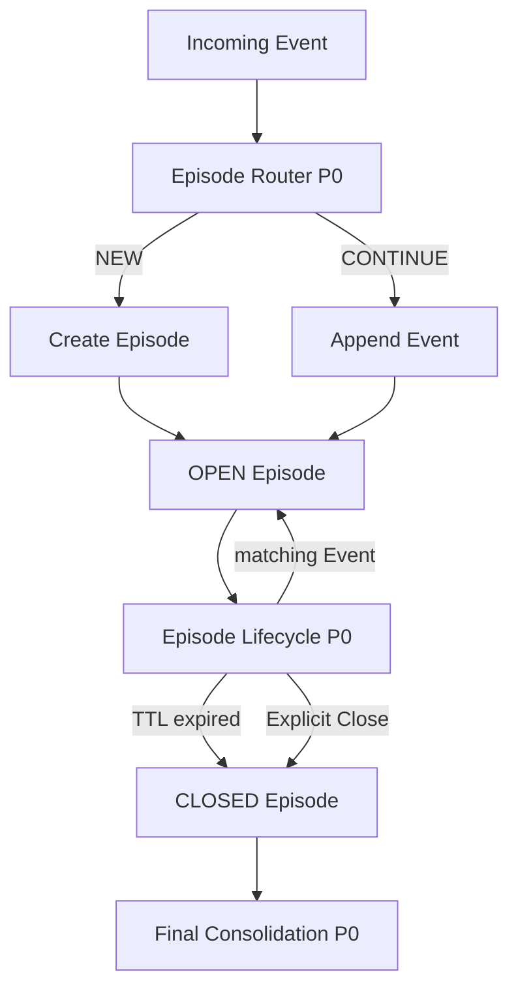

# Agent Memory 阶段备忘录：Episode Router / Lifecycle P0 冻结

**日期：2026-09-21**  
**范围：Memory 模块**  
**当前阶段：Episode Router P0 与 Episode Lifecycle P0 已完成，准备进入 Final Consolidation P0**

---

# 0. 一句话结论

当前 Memory 写入路径的前半段已经基本完成：

```text
Raw Event
↓
Episode Router P0
↓
NEW / CONTINUE
↓
Episode Lifecycle P0
↓
OPEN Episode
↓
TTL / Explicit Close
↓
CLOSED Episode
↓
Final Consolidation P0
```

其中：

```text
Episode Router P0
= DONE / USABLE / FROZEN FOR NOW

Episode Lifecycle P0
= DONE / USABLE / FROZEN FOR NOW
```

下一阶段不再继续优化 Router，也不引入复杂 Reconciliation（Episode 纠错重组）。

当前主线正式进入：

```text
Final Consolidation P0
```

---

# 1. 当前 Memory 写入路径

当前已经形成的最小写入路径：



Router 负责：

> 这条 Event 应该暂时放到哪个 Episode？

Lifecycle 负责：

> 这个 Episode 现在还能不能继续增长，以及什么时候结束？

两者职责已经分离。

---

# 2. Episode Router P0 冻结结论

## 2.1 Router 的职责

Router 只负责：

```text
Current Event
+
OPEN Episode Candidates
↓
CONTINUE(existing Episode)
or
NEW Episode
```

Router 不负责：

```text
Episode Merge
Episode Split
Detach
Reassign
Final Consolidation
Semantic Memory
Memory Graph
Recall
Activation
```

---

# 3. Router P0 当前冻结输入

当前 benchmark 支持的最佳输入结构：

```text
Current Event

+

Previous 5 Raw Events

+

Candidate Episode Summary

+

Candidate Episode Last 2 Raw Events
```

含义：

```text
Previous 5 Raw Events
=
最近聊天现场

Episode Summary
=
这个 Episode 整体在讲什么

Episode Last 2
=
这个 Episode 最近具体讲到哪里
```

当前实验结论说明：

> Router 需要的是少量、相关度高的 Context，而不是尽可能长的 Context。

---

# 4. Candidate Builder P0

当前 Candidate Builder：

```text
reply-target Episode first
+
most recent OPEN Episodes
```

最大：

```text
candidate_limit = 8
```

现有 benchmark 中：

```text
Candidate Missing ≈ 0
```

因此 Candidate Builder 当前不是主要瓶颈。

---

# 5. JEV 在 Router 中的定位

JEV 继续作为：

```text
Pointwise Scorer
```

即：

```text
Current Event + Candidate A
→ score A

Current Event + Candidate B
→ score B
```

而不是一次直接选择：

```text
A / B / C / NEW
```

JEV score 应理解为：

```text
relative semantic support
```

即：

> 当前证据有多支持“这条 Event 属于这个 Candidate Episode”。

不是严格概率：

```text
P(same_episode)
```

---

# 6. Router P0 Routing Policy

当前冻结策略：

```text
high_threshold = 0.55
low_floor      = 0.25
min_margin     = 0.15
```

逻辑：

```python
if best_score >= 0.55:
    CONTINUE

elif (
    best_score >= 0.25
    and best_score - second_score >= 0.15
):
    CONTINUE

else:
    NEW
```

当前结论：

> absolute threshold 单独不足；relative margin 有价值，但继续放宽会明显增加 contamination。

---

# 7. Context Benchmark 最终结论

## 7.1 原始 Baseline

```text
Previous 5
+
Episode Summary
```

Pairwise F1：

```text
≈ 0.543
```

---

## 7.2 Previous 8 + Last 2

```text
Previous 8
+
Episode Summary
+
Episode Last 2
```

结果明显退化：

```text
Pairwise F1 ≈ 0.462
False Merge 明显增加
Scorer Misrank 增加
Max Episode Size 明显增大
```

结论：

> 扩大公共群聊窗口会引入其他话题噪声。

---

## 7.3 Previous 5 + Last 2

```text
Previous 5
+
Episode Summary
+
Episode Last 2
```

结果：

```text
Pairwise Precision ≈ 0.605
Pairwise Recall    ≈ 0.559
Pairwise F1        ≈ 0.581
```

同时：

```text
False Split ↓
False Merge 略↓
Threshold Reject 38 → 26
False Continue 17 → 15
```

这是当前最好版本。

---

## 7.4 Previous 5 + Last 3

```text
Previous 5
+
Episode Summary
+
Episode Last 3
```

结果再次退化：

```text
Pairwise Precision ≈ 0.515
Pairwise Recall    ≈ 0.489
Pairwise F1        ≈ 0.502
Threshold Reject   26 → 30
Scorer Misrank     6 → 10
False Continue     15 → 19
```

结论：

> Candidate Recent Context 从 2 条增加到 3 条以后开始产生额外噪声。

---

# 8. Router P0 最终冻结配置

```yaml
candidate_limit: 8

local_context_events: 5

candidate_recent_events: 2

use_reply_signal: true

use_episode_summary: true

use_candidate_recent_events: true

routing_policy:
  high_threshold: 0.55
  low_floor: 0.25
  min_margin: 0.15
```

---

# 9. Router P0 当前阶段判断

当前判断：

```text
Episode Router P0
= DONE
= USABLE
= FROZEN FOR NOW
```

这里的 DONE 不表示理论最优。

它表示：

```text
P0 目标已经达到
继续参数优化边际收益很低
当前实现足够进入下游 Memory 模块
```

未来只有当：

```text
Final Consolidation
Recall
Memory Graph
Semantic Memory
```

等下游模块明确暴露 Router 为真实瓶颈时，才重新开启：

```text
Episode Router P1
```

---

# 10. Episode Lifecycle P0

Router 完成以后，Memory 写入路径进入 Episode Lifecycle。

Lifecycle P0 的职责非常简单：

> 管理一个 Episode 从创建、成长到关闭的过程。

---

# 11. Episode Lifecycle 状态

P0 只保留两个状态：

```text
OPEN
CLOSED
```

其中：

```text
OPEN
=
仍然可以继续接收 Event
```

```text
CLOSED
=
停止增长，可以进入 Final Consolidation
```

不引入：

```text
PENDING
DORMANT
ARCHIVED
REOPENED
MERGING
```

---

# 12. Lifecycle P0 状态机

```text
Router → NEW
↓
create_episode()
↓
OPEN

Router → CONTINUE
↓
append_event()
↓
OPEN
↓
reset TTL

TTL expired
or
explicit close
↓
CLOSED
```

允许：

```text
OPEN → CLOSED
```

P0 不支持：

```text
CLOSED → OPEN
```

---

# 13. Lifecycle P0 当前操作

当前实现包含：

```text
create_episode(event)

append_event(episode_id, event)

close_episode(episode_id)

close_expired(now)

get_open_episodes()

get_episode(episode_id)
```

---

# 14. CREATE

当 Router 返回：

```text
NEW
```

创建 Episode：

```text
status = OPEN

event_ids = [event.id]

created_at = event.timestamp

last_event_at = event.timestamp

expires_at = event.timestamp + TTL
```

---

# 15. APPEND

当 Router 返回：

```text
CONTINUE episode_id
```

执行：

```text
append Event
↓
last_event_at = current Event timestamp
↓
expires_at = current Event timestamp + TTL
```

即：

> 每一次有效 CONTINUE 都会重新刷新 Episode 的 inactivity timer。

---

# 16. TTL

TTL：

```text
Time To Live
```

在这里表示：

> 一个 OPEN Episode 多久没有新 Event 后自动关闭。

当前冻结的是：

```text
TTL expiry
→ OPEN becomes CLOSED
```

但不冻结：

```text
TTL = 3 days
```

具体 TTL 时长仍然是配置项。

目前代码中保留：

```text
3 days
```

只作为兼容默认值。

---

# 17. Explicit Close

Lifecycle P0 支持：

```text
close_episode(episode_id)
```

用于：

> 外部已经明确知道 Episode 应结束时主动关闭。

P0 不做：

```text
自然语言结束判断
JEV Close Question
LLM Close Classifier
```

---

# 18. CLOSED Episode

CLOSED Episode：

```text
不能接受普通 append
```

但：

```text
不会被删除
```

并且：

```text
仍然可以通过 get_episode() 获取
```

同时：

```text
不再进入 normal Router Candidate Set
```

它的下一站是：

```text
Final Consolidation
```

---

# 19. Lifecycle P0 当前阶段判断

当前：

```text
Episode Lifecycle P0
= DONE
= USABLE
= FROZEN FOR NOW
```

现有测试已经覆盖：

```text
NEW → OPEN

CONTINUE → append

append → TTL reset

TTL expiry → CLOSED

explicit close → CLOSED

CLOSED append rejected

CLOSED excluded from OPEN candidates
```

另计划/补充一个最小：

```text
Router + Lifecycle end-to-end smoke test
```

只验证整条主路径能够连通，不再进行真实 JEV benchmark。

---

# 20. 当前正式暂停 Reconciliation

之前曾计划：

```text
Router
↓
OPEN Episode
↓
Episode Reconciliation
↓
CLOSED
```

但经过 Router Context benchmark 后，当前工程决策改为：

```text
Router
↓
OPEN Episode
↓
Lifecycle
↓
CLOSED Episode
```

暂时不加入复杂：

```text
merge
split
detach
reassign
repair
history rewrite
```

原因：

```text
实现成本高
系统复杂度高
当前没有下游证据证明它是必要模块
```

当前原则：

> 先接受 Router 存在一定 fragmentation，再观察这些错误是否真的影响后续 Memory 使用。

---

# 21. 当前对 Router 错误的态度

目前更倾向：

```text
可以稍微碎
```

而不是：

```text
为了减少碎片而激进合并
```

原因：

False NEW：

```text
一个真实 Episode
被拆成两个相关 Episode
```

未来 Recall 仍可能同时激活它们。

而 False Continue：

```text
无关 Event
被塞进错误 Episode
```

会直接污染 Episode 本身。

因此当前优先避免：

```text
semantic contamination
```

而不是追求 Episode 数与 Teacher 完全一致。

---

# 22. 当前 Memory Write Path

当前已经完成：

```text
Raw Event
↓
Episode Router P0
✅ DONE

↓
Episode Lifecycle P0
✅ DONE

↓
CLOSED Episode
```

下一阶段：

```text
Final Consolidation P0
```

---

# 23. 下一阶段核心问题

下一阶段不应立即写复杂代码。

首先需要回答：

> 一个 CLOSED Episode 最少应该被整理成什么东西，才值得长期保存？

即：

```text
Final Consolidation P0 Output Schema
```

需要明确：

```text
输入是什么？

输出是什么？

Episode 本身保留什么？

是否在 Consolidation 阶段同时产生 Semantic Memory Candidate？

哪些信息值得长期保存？

哪些只是原始过程信息？
```

---

# 24. 当前暂时不要做

暂停：

```text
Router parameter sweep

Context window sweep

Candidate Last-N sweep

Reconciliation

Memory Graph

Activation

Recall

Interval Memory

Semantic Memory full implementation
```

先集中完成：

```text
Final Consolidation P0
```

---

# 25. 当前阶段总结

当前 Memory 项目已经完成了最前面的两个基础问题。

第一个：

> 零散 Event 应该怎么组成 Episode？

答案：

```text
Episode Router P0
```

第二个：

> Episode 怎么从开始走到结束？

答案：

```text
Episode Lifecycle P0
```

现在终于进入第三个问题：

> 一个已经结束的经历，到底应该留下什么？

这就是：

```text
Final Consolidation P0
```

---

# 26. 当前冻结状态

```text
Episode Router P0
= DONE

Episode Lifecycle P0
= DONE

Router / Lifecycle Smoke Test
= final engineering verification

Final Consolidation P0
= NEXT
```

---

# 27. 当前最重要的工程原则

```text
Keep the mechanics simple.

Only add complexity when downstream Memory behavior proves it necessary.
```

中文：

> 机械规则保持简单。只有当后续 Memory 使用真的证明某个复杂机制是必要的，才把它加回来。

目前 Router 与 Lifecycle 已经足够作为 Memory Write Path 的稳定基础继续向后构建。
