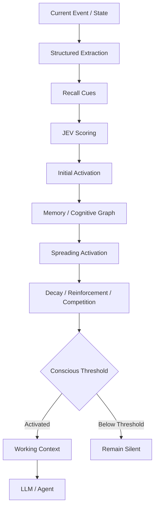
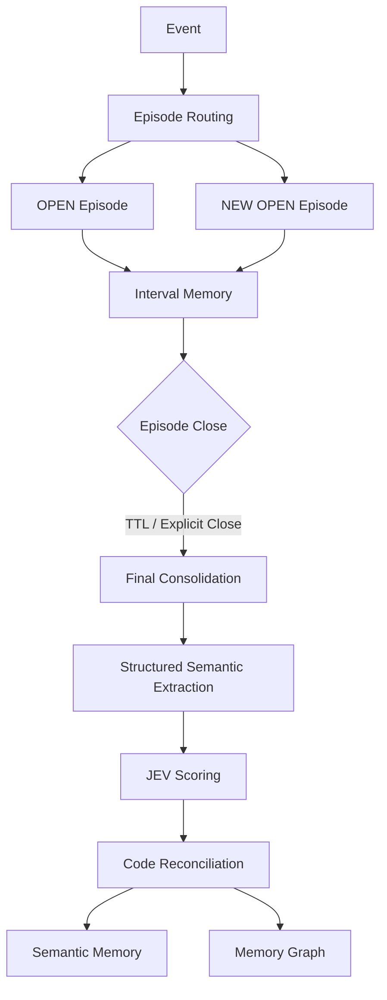
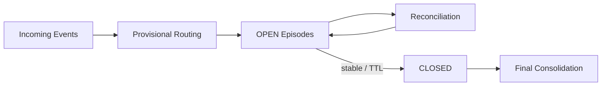
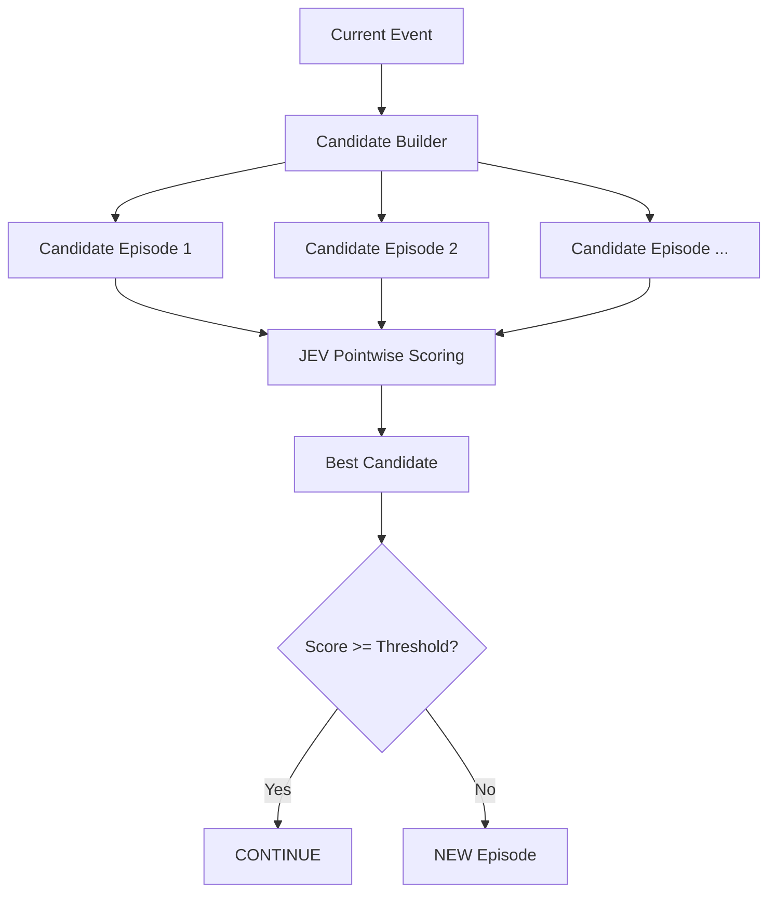
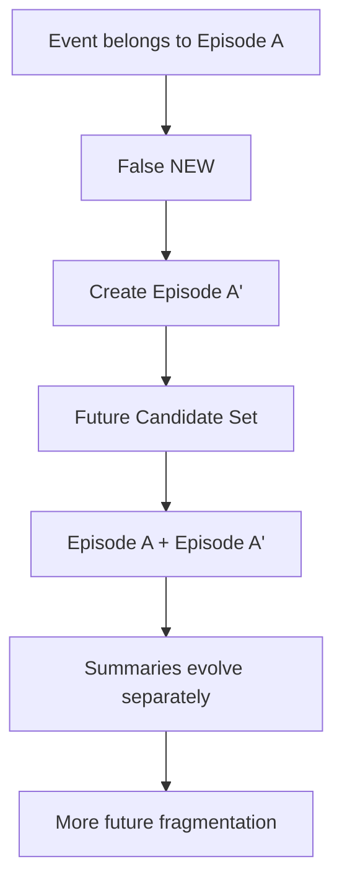
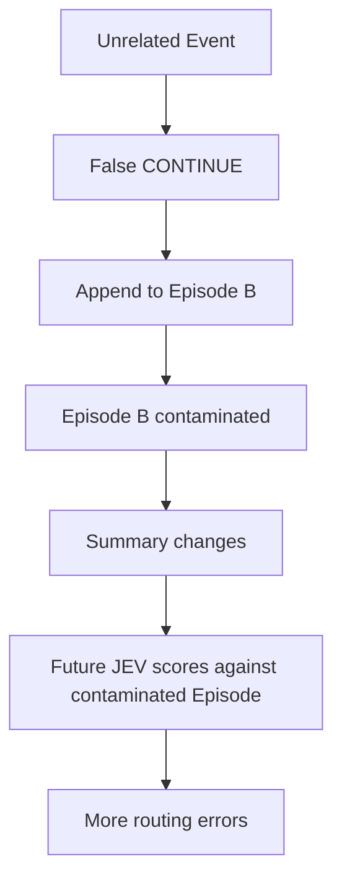
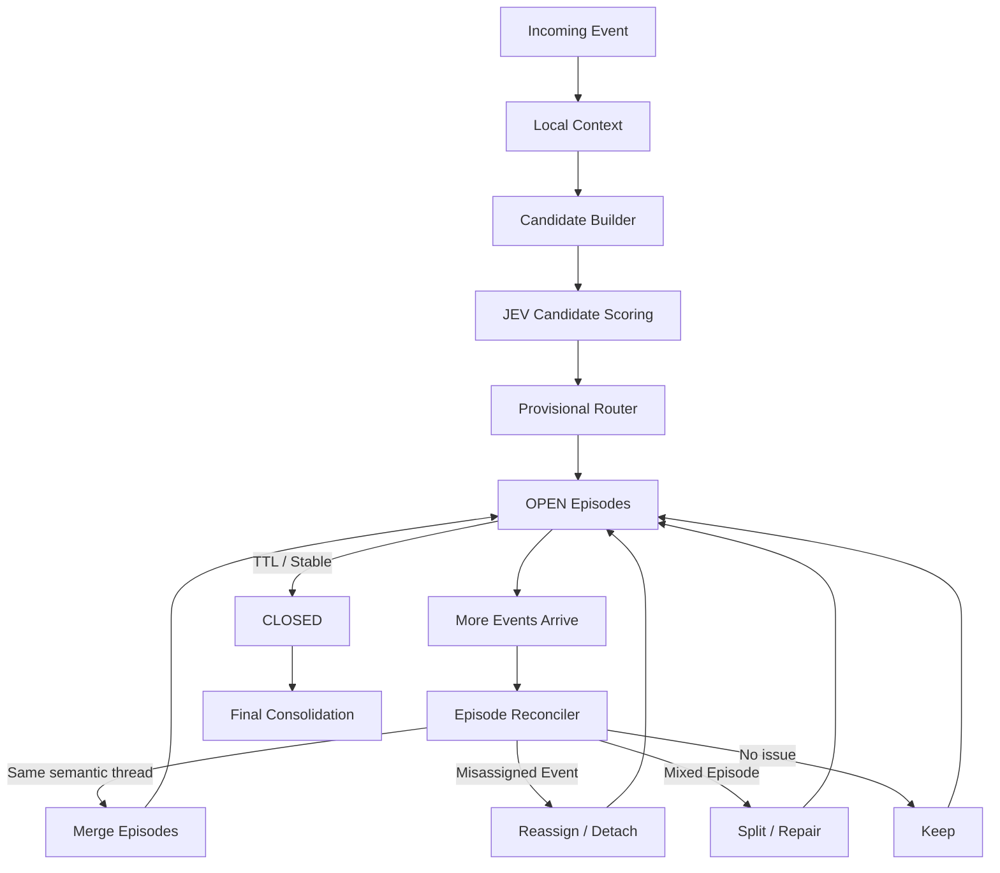
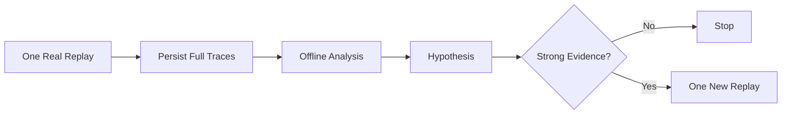
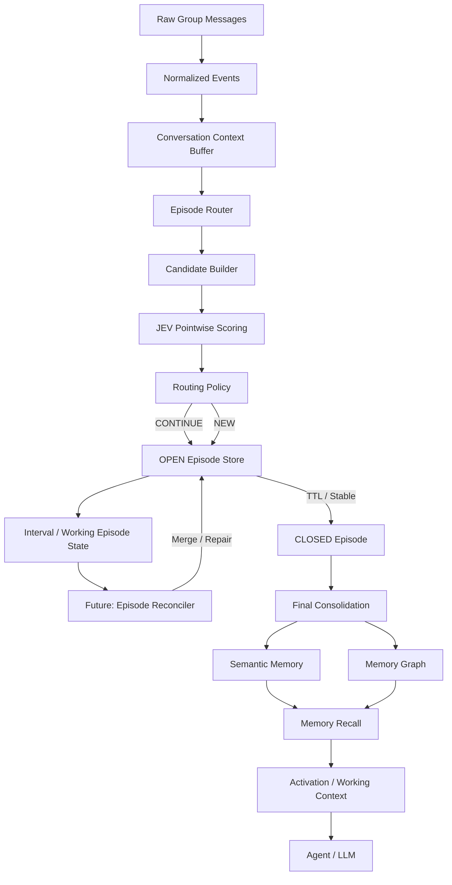
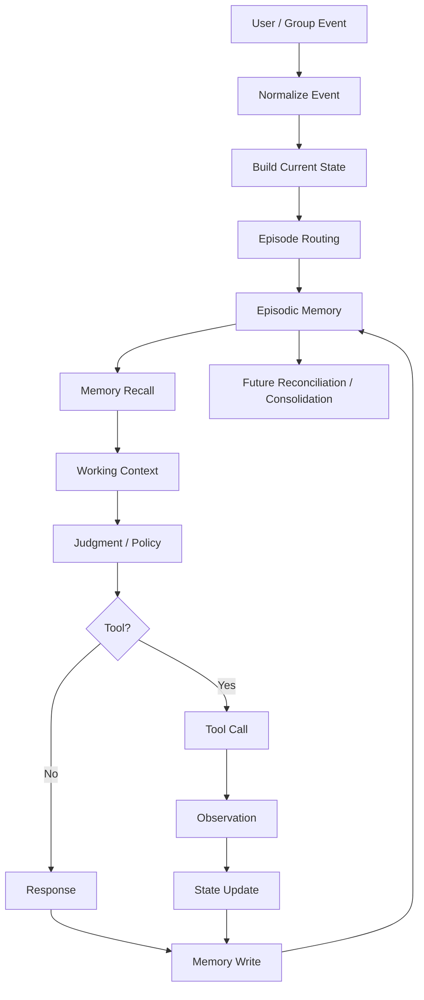

# Episode Memory / Episode Router 阶段研究备忘录

**日期：2026-09-21**  
**阶段：Episode Router P0 / P0.3 后**  
**状态：Router 参数实验阶段基本结束，准备转入 OPEN Episode Reconciliation**

---

# 0. 一句话结论

当前实验已经基本证明：

> **JEV + Local Context 能较可靠地判断“当前 Event 更像哪个已有 Episode”；当前主要瓶颈已经不再是 Candidate Recall 或基础语义排序，而是“单次在线、立即决定、基本不可反悔”的 Episode Routing 机制本身。**

通过 Absolute Threshold、Local Context、Threshold Calibration、Relative Margin 等多轮实验，Episode 数从极度碎片化状态逐渐下降，最新真实 replay 已达到：

```text
Teacher Silver Episodes: 32
Predicted Runtime Episodes: 54
```

但与此同时，进一步减少 False NEW 已经开始明显换来 False Continue / contamination。

因此当前判断是：

> **Single-pass irreversible Episode Routing 已接近当前架构的 Pareto Frontier。**

下一阶段不应继续大规模调：

```text
threshold
low_floor
margin
candidate_limit
```

而应将 Router 的角色从：

```text
最终归属判断
```

改成：

```text
provisional assignment
```

并引入：

```text
OPEN Episode Reconciliation
```

允许系统在获得更多后续证据后，对仍处于 OPEN 状态的 Episode 做：

```text
merge
reassign
detach
repair
```

其中第一版建议只从：

```text
duplicate OPEN Episode merge
```

开始。

---

# 1. 项目背景

Episode Memory 是当前 Memory Architecture 中负责保存：

> **“发生过什么”**

的长期记忆层。

与 Semantic Memory 的区别：

```text
Semantic Memory
= 稳定事实 / 属性 / 关系

Episodic Memory
= 一段发生过的事件线程
```

Episode 并不等于：

```text
连续时间窗口
```

而是：

> **语义上属于同一个事件线程的一组 Event。**

因此以下序列：

```text
A1
A2
A3
B1
B2
B3
A4
A5
```

应该允许表示为：

```text
Episode A:
A1 A2 A3 A4 A5

Episode B:
B1 B2 B3
```

即：

> Episode 可以在时间线上被其他话题打断，然后继续。

---

# 2. 当前 Memory 总体架构

当前长期设想中的 Memory Architecture：



这是 Memory Read Path。

---

# 3. Memory Write Path

长期设计：



当前真正实现和 benchmark 的重点还只在：

```text
Event
↓
Episode Routing
↓
OPEN Episodes
```

Interval Memory、Memory Graph、Final Consolidation 尚未进入当前 P0 实验范围。

---

# 4. Episode 生命周期

当前 Episode 生命周期刻意保持简单：

```text
OPEN
CLOSED
```

以及：

```text
TTL
```

默认曾讨论：

```text
TTL ≈ 3 days
```

语义：

```text
matching event
→ reset TTL

TTL expired
→ Episode CLOSED
```

注意：

```text
TTL expiry ≠ delete
```

而是：

```text
OPEN
→ CLOSED
→ Final Consolidation
```

---

# 5. 经过当前实验后，对 OPEN / CLOSED 的进一步理解

一开始：

```text
OPEN
```

主要意味着：

> Episode 尚未结束。

但经过 Router 实验，现在更合理的解释是：

```text
OPEN
=
Episode structure is still revisable
```

也就是：

> OPEN Episode 的内部结构和归属仍允许随着后续证据修正。

而：

```text
CLOSED
```

意味着：

> Episode 结构已经足够稳定，可以进入最终 Consolidation。

因此未来更完整的 lifecycle 应理解为：



---

# 6. JEV 定位

JEV 当前定位：

> **JudgmentProvider / Context-conditioned Scoring Model**

而不是传统 YES / NO 分类器。

基本抽象：

```text
score = f(
    State,
    Question,
    Option / Candidate
)
```

每个 Option 独立 pointwise scoring。

Episode Routing 中：

```text
Current Event
+
Local Context
+
Candidate Episode

↓ JEV

BELONGS score
```

JEV 更像：

```text
relative semantic support scorer
```

而不应该简单理解为：

```text
P(same episode)
```

---

# 7. xtw-core / JEV 已有设计结论

之前 benchmark 已得到四条重要结论：

```text
1.
System-One scorer 可以作为真实 JudgmentProvider。

2.
Judgment Question 不应该全部是 YES/NO。
事实判断需要 UNKNOWN / INSUFFICIENT_INFORMATION。

3.
能由 timestamp / state reconciliation 确定的问题，
先由 Code 解决，不浪费 Judgment。

4.
Participation threshold 必须用真实群聊数据校准，
优先控制 False Positive。
```

这些原则同样影响 Episode Router。

---

# 8. Episode Router P0 原始任务定义

核心任务：

```text
Current Event
+
OPEN Episodes
↓
Router
↓
existing Episode ID
or
NEW_EPISODE
```

初始流程：



---

# 9. Candidate Builder P0

当前 Candidate Builder 规则：

```text
reply-target Episode first
+
most recent OPEN Episodes
```

最大：

```text
candidate_limit = 8
```

目前实验中：

```text
Candidate Missing ≈ 0
```

因此目前没有证据表明：

```text
Candidate Builder
```

是主要瓶颈。

---

# 10. Teacher Dataset

实验数据来自真实 QQ 群聊天。

原始数据：

```text
12,493 messages
7 days
```

特点：

```text
median inter-message gap ≈ 8 seconds
```

且：

```text
only ~15 gaps > 1 hour
```

因此：

> 单纯依靠时间窗口不能可靠定义 Episode。

数据中存在大量：

```text
reply edges
images
forwarded messages
short utterances
interleaved conversations
```

---

# 11. Teacher Silver Dataset

最终选取一个连续 300-message slice：

```text
300 messages
```

人工/强模型语义标注：

```text
32 Episodes
5 UNRESOLVED
23 review cases
```

允许：

```text
non-contiguous semantic thread
```

状态：

```text
Teacher Silver
not Human Gold Truth
```

因此所有 benchmark 都必须记住：

> Teacher 本身仍然存在边界歧义。

---

# 12. 为什么没有自动生成整个 12k Teacher

早期尝试 automatic clustering：

```text
12k messages
→ automatic topic clustering
```

结果出现：

```text
giant clusters
topic drift
semantic contamination
```

因此放弃。

当前 Teacher Silver 是：

```text
small
continuous
semantically reviewed
```

优先保证：

```text
quality > scale
```

---

# 13. P0 初始 Absolute Threshold Router

初始 decision：

```python
if best_score >= threshold:
    CONTINUE(best_episode)
else:
    NEW
```

NEW 是 residual decision。

没有增加：

```text
"Is this a NEW Episode?"
```

第二个 JEV Question。

这样避免：

```text
double calls
```

---

# 14. Benchmark 设计上的一次重要教训

曾经设计：

```text
threshold sweep
+
reply ablation
+
full replay
```

但由于：

```text
300 events
× up to 8 candidates
× multiple threshold runs
× ablations
```

实际造成：

```text
~20,000 JEV calls
```

这是一个明显错误的实验设计。

此后确定原则：

> **优先保存 candidate scores，然后进行 0-call offline analysis。**

除非离线证据已经明确支持某个实验，否则：

```text
不要真实 replay
```

---

# 15. Absolute Threshold Baseline

P0 早期 baseline：

```text
threshold = 0.65
```

结果：

```text
Pairwise F1 ≈ 0.260

False Split ≈ 83.8%
False Merge ≈ 0.54%

NEW F1 ≈ 0.296

Predicted Episodes = 83
Teacher Episodes = 32
```

降低 threshold：

```text
0.50
```

得到：

```text
Pairwise F1 ≈ 0.340
Predicted Episodes = 52
```

进一步：

```text
0.40
```

得到：

```text
Pairwise F1 ≈ 0.348
Predicted Episodes = 39
```

但仅降低 threshold 不能解决错误 candidate 高分问题。

---

# 16. Offline Failure Analysis — Absolute Threshold 阶段

保存 traces 后做过 0-call failure analysis。

Baseline：

```text
resolved rows = 295
unresolved = 5
trace rows = 2282
```

Failure：

```text
Candidate Missing = 0
Threshold Reject = 65
Scorer Misrank = 35
Cascade Error = 1
False Continue = 15
```

其中最重要的发现：

```text
Candidate Missing = 0
```

说明：

> Candidate Builder 基本能够找到正确 Episode。

真正问题主要是：

```text
Threshold
+
Scorer Ranking
```

---

# 17. Local Context Injection

分析发现很多失败来自：

```text
"我也拍到了"
"不是"
"对不起我没憋住笑"
```

这种短消息脱离聊天上下文时几乎不可判断。

因此 P0.1 给 JEV 增加：

```text
previous 5 raw timeline events
```

以及：

```text
Reply Target Content
```

其中 Local Context 独立于 EpisodeStore。

非常重要：

```text
Current Event
永远不能出现在自己的 Local Context 中
```

---

# 18. P0.1 Local Context 结果

固定：

```text
threshold = 0.65
candidate_limit = 8
local_context_events = 5
```

结果：

```text
Pairwise Precision = 0.856299
Pairwise Recall    = 0.169657
Pairwise F1        = 0.283203

False Split        = 0.830343
False Merge        = 0.001789

NEW Recall         = 0.90625

Predicted Episodes = 141
```


虽然 Episode 数反而上升，但 failure structure 出现重大变化：

```text
Candidate Missing = 0
Threshold Reject  = 105
Scorer Misrank    = 2
Cascade Error     = 2
False Continue    = 3
```


最重要的变化：

```text
Scorer Misrank
35 → 2
```

这证明：

> Local Context 极大改善了 candidate ranking。

---

# 19. P0.1 的关键解释

Local Context 后：

```text
JEV generally knows WHICH Episode
```

但：

```text
absolute score often below threshold
```

即：

```text
ranking correct
confidence conservative
```

因此问题从：

```text
Scorer Ranking
```

转化成：

```text
Score Calibration
```

---

# 20. Offline Threshold Calibration

基于保存 scores：

```text
JEV calls = 0
Replay = 0
```

分析：

```text
Teacher CONTINUE:
best_correct_score

Teacher NEW:
best_existing_score
```

得到大致分布：

```text
CONTINUE correct score
median ≈ 0.73

Teacher NEW best-existing
median ≈ 0.18
```

离线候选：

```text
threshold 0.55
```

因此只进行了：

```text
ONE real replay
```

---

# 21. P0.2 — threshold = 0.55

配置：

```yaml
routing_threshold: 0.55
candidate_limit: 8
recent_events_limit: 5
local_context_events: 5
use_reply_signal: true
```

结果：

```text
Pairwise Precision = 0.864865
Pairwise Recall    = 0.274571
Pairwise F1        = 0.416815

False Split        = 0.725429
False Merge        = 0.002696

NEW Precision      = 0.247706
NEW Recall         = 0.84375
NEW F1             = 0.382979

Predicted Episodes = 113

Mean Episode Size  = 2.65
Max Episode Size   = 20
```


---

# 22. P0.2 Failure Analysis

共：

```text
90 error rows
```

其中：

```text
Candidate Missing = 0
Threshold Reject  = 81
Scorer Misrank    = 3
Cascade Error     = 1
False Continue    = 5
```


即：

```text
Threshold Reject
≈ 90% of routing errors
```

---

# 23. Absolute Threshold 的结构性问题

出现大量：

```text
correct candidate
明显领先
但 best_score < 0.55
```

例如：

```text
correct = 0.54
wrong   = 0.05
```

仍然：

```text
NEW
```

又如：

```text
correct = 0.52
wrong   = 0.07
```

仍然：

```text
NEW
```

因此：

> Absolute Score 不足以表达 candidate certainty。

---

# 24. Relative Margin

定义：

```text
margin
=
best_score
-
second_best_score
```

问题转化为：

> 即使 JEV 绝对 score 较低，如果 best candidate 明显领先其他 candidates，是否仍应 CONTINUE？

---

# 25. Offline Relative Margin Analysis

完全使用 persisted traces：

```text
JEV calls = 0
Replay = 0
Router modifications = 0
```


主要结果：

```text
Teacher CONTINUE correct margin:

count  = 258
median = 0.44
p25    = 0.19
p75    ≈ 0.62
```

Threshold Reject：

```text
median correct margin ≈ 0.08
p75 ≈ 0.23
```

Teacher NEW：

```text
best-existing vs second-best margin:

median = 0.04
p75    = 0.11
```


---

# 26. Threshold Reject Margin Distribution

81 个 Threshold Reject 中：

```text
margin >= 0.05 : 46
margin >= 0.10 : 37
margin >= 0.15 : 32
margin >= 0.20 : 23
margin >= 0.25 : 16
margin >= 0.30 : 12
margin >= 0.40 : 4
```


这证明：

> 大量 False NEW 并不是 candidate ambiguity，而是 absolute threshold 拒绝了相对明确的 candidate。

---

# 27. Offline Margin Policy

离线最终推荐：

```text
high_threshold = 0.55
low_floor      = 0.25
min_margin     = 0.15
```

即：

```python
if best_score >= 0.55:
    CONTINUE

elif (
    best_score >= 0.25
    and best_score - second_score >= 0.15
):
    CONTINUE

else:
    NEW
```

---

# 28. Offline Margin Estimate

保存 candidate states 上模拟：

```text
rescued_threshold_rejects = 22
new_false_continues       = 1

CONTINUE recall ≈ 83.3%
NEW recall      ≈ 81.2%
```


但必须强调：

```text
offline simulation
≠
causal sequential replay
```

因为一次不同 routing 会改变：

```text
Episode state
candidate set
summary
future routing
```

---

# 29. Margin Policy 的危险性已经在 Offline 阶段可见

Teacher NEW 里也存在：

```text
low absolute score
+
large relative margin
```

例如：

```text
Teacher NEW

best = 0.48
second = 0.33
margin = 0.15
```


说明：

> Margin 不能单独使用，必须有 absolute floor。

---

# 30. Astra 架构优化 + Luna Replay

随后使用更强 Agent Astra 对当前 Router 架构进行一次架构调整。

测试本身由 Luna 执行，而不是 Astra。

这点很重要：

> 实验改善主要来自架构变化，而不是因为换了更强模型直接参与 Episode 判定。

唯一真实 replay：

```text
300 / 300 events
```

Candidate scoring calls：

```text
2179
```

加上：

```text
1 preflight
```

实际总 JEV calls：

```text
2180
```

运行中：

```text
1 provider URLError
```

采用：

```text
fail-closed
```

没有重新 replay。

---

# 31. Astra / Margin Replay 结果

当前已知最终运行结果：

```text
P0.2:
Predicted Episodes = 113

Astra / Margin architecture:
Predicted Episodes = 54
```

即：

```text
113
→
54
```

减少：

```text
59 Episodes
≈ 52%
```

这是非常显著的 fragmentation reduction。

---

# 32. Margin Decisions

本轮：

```text
margin decisions = 37
```

其中：

```text
correct    = 24
incorrect  = 9
unresolved = 4
```

因此 margin routing 确实：

> 成功修复了大量原先 Absolute Threshold 导致的 False NEW。

但与此同时：

> False Continue / contamination 开始明显出现。

因此当前初步状态：

```text
MARGIN_POLICY_TOO_AGGRESSIVE
```

---

# 33. 为什么 54 不能简单解释为“越来越接近 32，所以越来越好”

Teacher：

```text
32
```

Predicted：

```text
54
```

表面看来已经很接近。

但：

```text
Episode Count
```

不是 optimization target。

不能：

```text
一直降低 threshold / margin
直到 Episode Count ≈ 32
```

否则很容易得到：

```text
正确数量
+
错误结构
```

---

# 34. 当前真正出现的 Trade-off

当前系统进入：

```text
False Split
        ↕
False Merge
```

trade-off。

当 Router 更保守：

```text
更多 NEW
↓
更多 fragmentation
↓
更少 contamination
```

当 Router 更激进：

```text
更多 CONTINUE
↓
更少 fragmentation
↓
更多 contamination
```

因此当前已经明显出现：

```text
Pareto Frontier
```

---

# 35. 当前 Router 架构的真正限制

当前 Router 隐含要求：

```text
在 Event 到达的时刻
立即判断它最终属于哪个 Episode
```

但真实群聊有大量：

```text
“？”
“不是”
“我也拍到了”
“笑死”
[图片]
[转发消息]
```

这些 Event 在：

```text
t
```

时刻信息天然不足。

但：

```text
t+3
t+5
```

之后，人类可能非常容易理解它属于哪条线程。

因此当前 Router 实际被要求完成：

> **在信息不足时做永久正确的最终决策。**

这是结构性困难。

---

# 36. Stateful Error Amplification

Episode Routing 不是普通分类。

它是：

> Stateful Online Clustering。

一次错误会改变未来系统状态。

---

# 37. False NEW 的反馈



即：

```text
False NEW
↓
duplicate Episode
↓
future state becomes harder
↓
more False NEW
```

---

# 38. False CONTINUE 的反馈



即：

```text
False CONTINUE
↓
Episode contamination
↓
summary contamination
↓
future routing contamination
```

---

# 39. 为什么继续调 threshold / margin 收益会迅速下降

因为未来 JEV 判断的 candidate：

> 已经不是干净的 semantic objects。

有些 candidate 已经：

```text
被 split
被 merged
被 contaminated
```

此时：

```text
best_score
second_score
margin
```

都在一个已经发生结构错误的 Episode state 上计算。

所以进一步调：

```text
0.55
0.25
0.15
```

只能修 decision surface。

无法修：

```text
state corruption
```

---

# 40. 当前架构上限判断

目前判断：

```text
JEV scorer ceiling
→ 尚未证明达到

Candidate Builder ceiling
→ 尚未达到，当前不是主要瓶颈

Local Context Router ceiling
→ 已较接近

Single-pass irreversible routing ceiling
→ 基本已经摸到

Episode Memory architecture ceiling
→ 远未达到
```

---

# 41. 当前 Router 的角色应该改变

以前：

```text
EpisodeRouter.route(event)

→ final assignment
```

未来：

```text
EpisodeRouter.route(event)

→ provisional assignment
```

Router 应回答：

> “在当前证据下，这个 Event 暂时最合理地放在哪里？”

而不是：

> “这个 Event 永久、最终属于哪里？”

---

# 42. 下一阶段：Episode Reconciliation

新的核心结构：



---

# 43. Reconciler 与 Final Consolidation 不同

Episode Reconciler：

```text
作用对象:
OPEN Episodes

作用:
修复正在形成中的 Episode structure
```

Final Consolidation：

```text
作用对象:
CLOSED Episode

作用:
生成最终 Episodic / Semantic representation
```

两者不能混在一起。

---

# 44. Reconciler 应该解决的两类核心错误

## False NEW

原来：

```text
A1
↓
Episode A

A2
↓
False NEW
↓
Episode A'
```

Reconciler：

```text
Episode A
+
Episode A'

→ Merge
```

---

## False CONTINUE

原来：

```text
Episode A:
A1
A2
B1  ← wrong
A3
```

Reconciler：

```text
detach B1
```

然后：

```text
B1
→ another Episode
or
→ NEW Episode
```

---

# 45. Reconciliation P0 不应该一次做完所有事情

当前不建议直接实现：

```text
Merge
Split
Detach
Reassign
Graph optimization
Global clustering
```

第一版最好只测试：

> **Duplicate OPEN Episode Merge**

即：

```text
OPEN Episode A
OPEN Episode A'
```

如果后续证据表明：

```text
same semantic thread
```

则：

```text
merge
```

---

# 46. 为什么先做 Merge

当前实验最明确的问题仍然是：

```text
fragmentation
```

而 Merge：

```text
简单
局部
可解释
容易 benchmark
```

比 Split / Event reassignment 更适合 P0。

---

# 47. Reconciliation P0 初步形式

可能形式：

```text
OPEN Episodes
↓
select likely duplicate pairs
↓
score same-thread probability
↓
merge if sufficiently supported
```

例如：

```text
ep_17:
刀术表演

ep_26:
什么时候表演

ep_31:
表演以后我的风评
```

后续证据可能表明：

```text
ep_17
ep_26
ep_31
```

其实都属于：

```text
same Episode
```

则合并。

---

# 48. 未来 Router + Reconciler 的职责分工

```text
Router
=
Where should this Event go NOW?

Reconciler
=
Given more evidence,
was our previous structure actually right?
```

这两个任务本质不同。

---

# 49. 当前已经可以冻结的设计结论

## 49.1 Episode 是 semantic thread

不是固定时间窗口。

---

## 49.2 Episode 可以 non-contiguous

中间允许其他线程插入。

---

## 49.3 Candidate Builder 使用 OPEN Episodes

当前：

```text
reply target
+
recent OPEN Episodes
```

是可接受 P0。

---

## 49.4 Local Context 必须存在

至少当前 benchmark 支持：

```text
previous 5 raw events
+
reply target content
```

---

## 49.5 JEV 更适合 scorer，而不是概率 classifier

其 score 应优先解释成：

```text
relative semantic support
```

---

## 49.6 单一 absolute threshold 不够

已经明确出现：

```text
correct top candidate
+
large margin
+
absolute score below threshold
```

---

## 49.7 Relative Margin 有价值

它能显著降低 fragmentation。

但：

```text
不能无限放宽
```

---

## 49.8 Router 不应该被要求永久正确

它应该：

```text
provisional
```

---

## 49.9 OPEN Episode 应允许修订

这是当前阶段最重要的新结论之一。

---

# 50. 当前不应该做的事情

暂时停止：

```text
threshold sweep
margin sweep
low_floor sweep
candidate_limit sweep
reply ablation
context length ablation
```

也不要：

```text
继续为了接近 32 Episodes 调参数
```

---

# 51. 当前也不应该立即做的东西

暂缓：

```text
完整 Memory Graph
Activation propagation
Interval Memory
复杂 Final Consolidation
global episode reclustering
```

当前首要问题仍然是：

```text
Episode structure stability
```

---

# 52. 实验方法论结论

当前项目已经得到一个非常重要的工程方法：

```text
Real JEV calls
非常贵
```

因此 future benchmark workflow 应固定为：



原则：

> **一个真实 replay 必须尽可能产生可重复利用的 traces。**

---

# 53. Agent 使用策略

经过 Astra 本轮高额度消耗后，推荐明确分工。

## Astra

只用于：

```text
architecture review
architecture redesign
hard conceptual dead-end
```

不要用于：

```text
parameter sweep
routine benchmark
data aggregation
```

---

## Luna / Codex

用于：

```text
implementation
tests
replay execution
offline statistics
failure analysis
```

---

## JEV

只在：

```text
offline evidence already supports experiment
```

时进行一次真实 replay。

---

# 54. 当前真实调用成本参考

最新真实 replay：

```text
candidate scoring calls = 2179
preflight calls = 1

total real JEV calls ≈ 2180
```

出现：

```text
1 URLError
```

采取：

```text
fail-closed
```

没有因此重复整个 benchmark。

这应成为 future benchmark 的正确行为。

---

# 55. 当前阶段最重要的数据总览

| 阶段 | 核心变化 | Predicted Episodes | Pairwise F1 | 主要问题 |
|---|---|---:|---:|---|
| Early Absolute Router | Absolute threshold | 高度碎片 | ~0.26–0.35 | Split / Misrank |
| P0.1 | + Local Context | 141 | 0.283 | Threshold Reject |
| P0.2 | threshold 0.55 | 113 | 0.417 | 81 Threshold Reject |
| P0.3 / Astra Margin | + relative routing architecture | **54** | 当前备忘录未固定完整最终指标 | Merge / contamination 开始明显 |

注意：

> 最后一行目前在本备忘录中仅冻结已经确认的 `54 Episodes`、margin decision counts、JEV call counts 和初步 failure conclusion；完整最终 benchmark 指标应以后续 Astra/Luna 最终报告为准。

---

# 56. 当前阶段最强实验信号

从：

```text
141
→
113
→
54
```

可以看到：

> Router design 确实强烈影响 Episode fragmentation。

但同时：

> 越继续减少 fragmentation，False Continue / contamination 成本越明显。

这就是当前架构已接近 Pareto Frontier 的主要证据。

---

# 57. 当前研究结论：不是“JEV 不够聪明”

目前没有证据说明：

```text
更强 JEV
```

本身就能解决所有 Episode 问题。

当前更大的结构性问题是：

```text
time of decision
+
irreversibility of decision
+
state feedback
```

即：

> 判断发生得太早，而且一旦错了系统缺乏后续修复机制。

---

# 58. 当前研究结论：不是“继续压 Episode 数”

54 与 32 的差距：

```text
22 Episodes
```

并不能直接解释为：

```text
还有 22 个 Router errors
```

其中可能混合：

```text
真实 fragmentation
Teacher boundary ambiguity
image-only ambiguity
short utterance ambiguity
summary contamination
runtime duplication
```

因此下一阶段必须研究：

```text
结构
```

而不是：

```text
单个数字
```

---

# 59. 当前 P0 Router 可以视为基本完成

P0 Router 已经证明：

```text
Candidate Builder
+
Local Context
+
JEV Scoring
+
simple routing policy
```

可以形成一个可运行 Episode routing system。

它还不完美，但已经足够作为：

```text
provisional routing layer
```

继续往上构建。

因此：

> 不需要为了追求 benchmark perfection 阻塞整个 Memory Architecture。

---

# 60. 下一阶段建议名称

不要继续叫：

```text
Episode Router P0.4
```

建议进入独立阶段：

# Episode Reconciliation P0

副标题：

```text
OPEN Episode Duplicate Merge / Structural Repair
```

---

# 61. Episode Reconciliation P0 建议研究问题

第一轮只回答：

> **如果允许在更多后续证据出现后合并重复 OPEN Episodes，能否继续减少 fragmentation，同时不显著增加 semantic contamination？**

---

# 62. Reconciliation P0 第一版建议范围

只做：

```text
MERGE
```

不做：

```text
split
detach
global clustering
full history rewrite
```

避免再次把实验范围扩大。

---

# 63. Reconciliation P0 也应该先离线

建议先：

```text
0 JEV calls
```

使用现在的：

```text
54 runtime Episodes
```

做离线分析：

```text
哪些 runtime Episodes
对应同一个 Teacher Episode？
```

然后检查：

```text
summary similarity
event overlap
reply relation
existing JEV evidence
temporal relation
```

看能否构造：

```text
duplicate Episode candidate pairs
```

---

# 64. 下一阶段真正值得 benchmark 的对象

不是：

```text
Event → Episode
```

而是：

```text
Episode ↔ Episode
```

即：

> 两个 OPEN Episodes 是否其实属于同一条 semantic thread？

这与当前 Router 的 Event-to-Episode scoring 是不同任务。

---

# 65. 可能的未来形式

未来 Reconciler 可能：

```text
score = f(
    Episode A state,
    Episode B state,
    recent context,
    relation evidence
)
```

Question：

```text
Should these OPEN Episodes be treated
as the same evolving semantic thread?
```

但当前还不应立即实现复杂模型。

---

# 66. 与 Interval Memory 的关系

未来：

```text
OPEN Episode
```

内部可以生成：

```text
Interval Memory
```

表示：

> 当前阶段的暂时结论。

Reconciliation 发生后：

```text
Interval Memory
```

也可能需要随 Episode merge / repair 更新。

因此最好先稳定 Episode structure，再大规模实现 Interval Memory。

---

# 67. 与 Final Consolidation 的关系

Final Consolidation 不应该承担：

```text
修复大量明显 runtime fragmentation
```

最好在：

```text
OPEN phase
```

就处理大部分结构问题。

否则：

```text
CLOSED Episode
```

本身已经是错误结构，后续 Semantic Memory 也会被污染。

---

# 68. 与 Memory Graph 的关系

Memory Graph 未来可能连接：

```text
Episode
Semantic Memory
Entities
Other Memories
```

如果 Episode node 本身严重碎片化：

```text
graph
```

也会产生大量重复节点和错误边。

因此：

> Reconciliation 是 Memory Graph 之前很值得解决的一层。

---

# 69. 当前阶段最大的工程风险

## Risk 1 — Benchmark overfitting

只有：

```text
300 messages
32 Teacher Silver Episodes
```

不能把当前参数当成 universal defaults。

---

## Risk 2 — Teacher Silver

不是 Human Gold Truth。

---

## Risk 3 — Image-only Messages

当前很多图像消息只有：

```text
[图片:xxx.jpg]
```

没有真实视觉内容。

因此相关 routing errors 并不能完全归因于 Router。

---

## Risk 4 — Summary Quality

如果 Episode Summary 失败或污染：

```text
JEV scoring
```

也会受到影响。

---

## Risk 5 — Stateful Cascade

单次错误会影响未来 benchmark state。

因此简单 per-row accuracy 不能完全反映系统质量。

---

# 70. 当前阶段最值得保留的失败分类

继续保留：

```text
Candidate Missing
Threshold Reject
Scorer Misrank
Cascade Error
False Continue
```

未来 Reconciliation 可增加：

```text
Duplicate Fragment
Contaminated Episode
Late Merge Opportunity
Incorrect Merge
```

---

# 71. 当前阶段的总体架构视图



---

# 72. 当前阶段的 Agent Loop 视图



---

# 73. 最终阶段判断

经过当前所有实验，可以得到一个比较清晰的阶段性判断：

> **我们已经基本摸到了“单次在线、立即决定、不可反悔”的 Episode Router 架构上限。**

但这不是：

```text
Episode Memory architecture 上限
```

相反：

> 这次实验揭示了下一层真正应该存在的模块。

即：

```text
Episode Reconciliation
```

---

# 74. 最核心的架构转向

从：

```text
Perfect Online Routing
```

转向：

```text
Best-effort Online Routing
+
Revisable OPEN Episodes
+
Reconciliation
+
Final Consolidation
```

这是当前阶段最重要的设计变化。

---

# 75. 当前可以正式冻结的 P0 Router 结论

```text
1.
Episode 是 semantic thread，不是时间窗口。

2.
Episode 可以 non-contiguous。

3.
Candidate Builder 当前不是主要瓶颈。

4.
Local Raw Context 对 routing 非常重要。

5.
Reply Target Content 应保留。

6.
JEV pointwise scorer 能提供真实语义 continuity signal。

7.
单一 absolute threshold 不足。

8.
Relative margin 有明显价值。

9.
继续放宽 margin 会带来明显 False Continue / contamination。

10.
Router assignment 应视为 provisional。

11.
OPEN Episodes 应允许后续结构修正。

12.
继续 Router 参数优化的边际收益已经很低。

13.
下一阶段应转入 Episode Reconciliation。
```

---

# 76. 下一阶段前不要忘记的成本教训

真实 JEV benchmark 很贵。

当前原则：

```text
Offline first.
Replay once.
Persist everything.
Analyze repeatedly.
```

避免再次出现：

```text
数万次无必要 JEV calls
```

或者：

```text
Astra 用于 routine tuning
```

更强 Agent 应保留给：

```text
架构级问题
```

而不是：

```text
0.15 vs 0.20
```

---

# 77. 当前项目状态

可以概括成：

```text
Episode Router P0
≈ DONE AS PROVISIONAL ROUTER

Absolute calibration
≈ explored

Local Context
≈ validated

Relative Margin
≈ validated but aggressive

Single-pass irreversible routing
≈ near structural limit

OPEN Episode Reconciliation
≈ NEXT
```

---

# 78. 下一次继续项目时，从这里开始

不要再从：

```text
“threshold 应该是多少？”
```

开始。

应该直接问：

> **一个 OPEN Episode 在生命周期中是否允许重新组织？**

答案当前倾向：

```text
YES
```

然后定义：

```text
Episode Reconciliation P0
```

第一版只研究：

> **duplicate OPEN Episode merge**

如果这一层成功，再考虑：

```text
detach
reassign
split
```

最后才进入：

```text
Final Consolidation
Memory Graph
Activation
```

---

# 79. 当前阶段最终结论

这轮工作的真正成果并不是：

```text
113 Episodes
→
54 Episodes
```

而是我们识别出了一个更深层的事实：

> **Episode Routing 不是一个一次性的分类问题，而是一个随着证据增加持续演化的在线结构形成问题。**

因此未来架构的重点应该从：

```text
How do we make the first decision perfect?
```

转向：

```text
How do we make early decisions cheap,
useful,
and revisable?
```

这应该成为下一阶段 Episodic Memory 设计的核心原则。