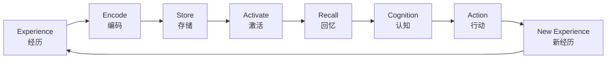
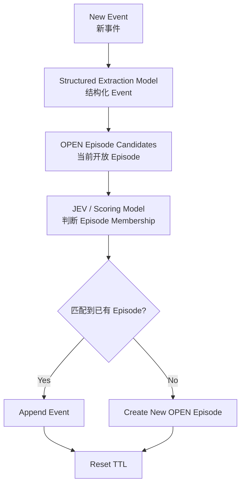
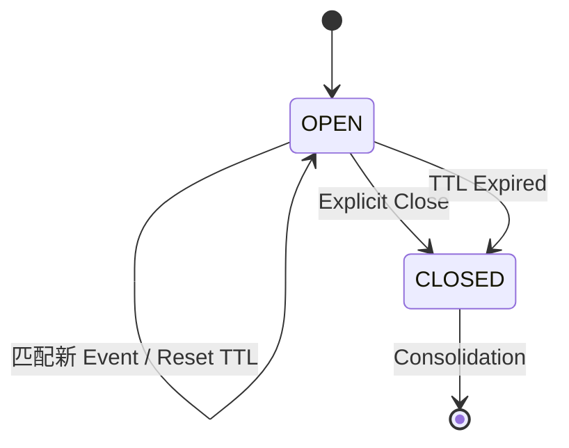
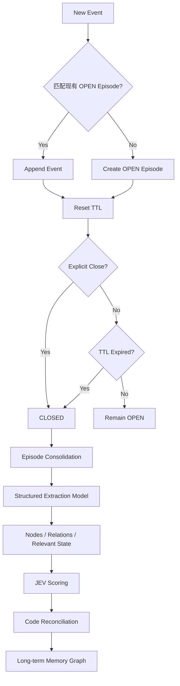
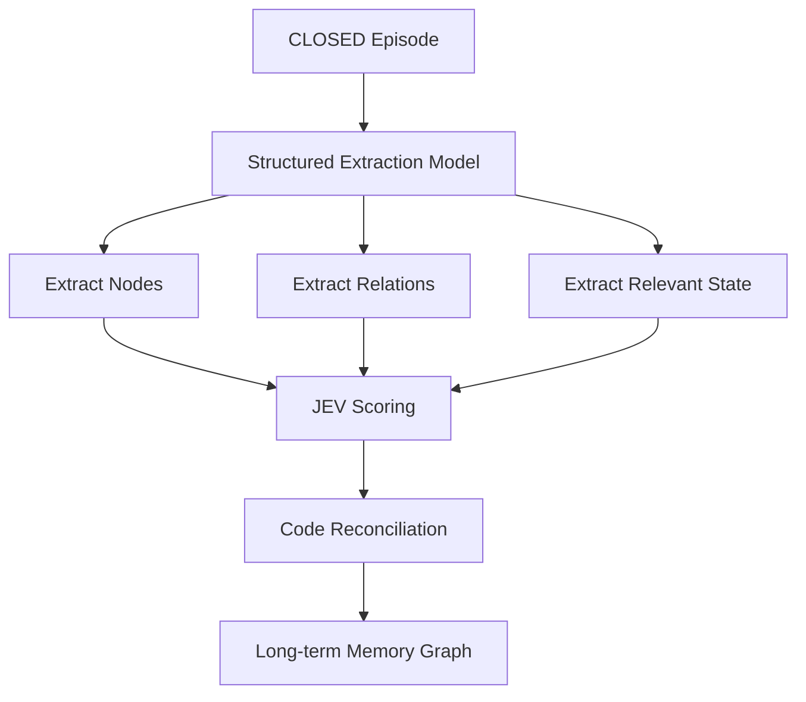
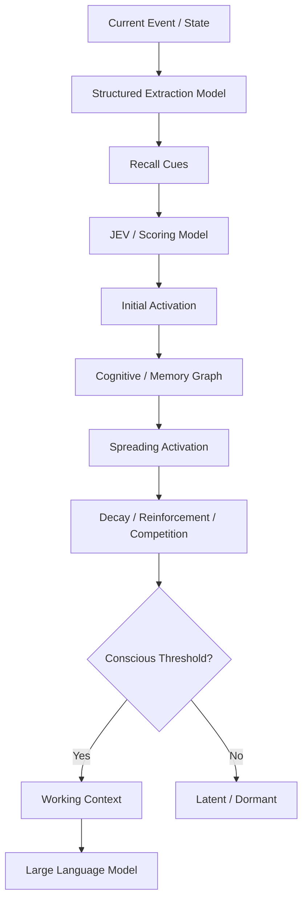
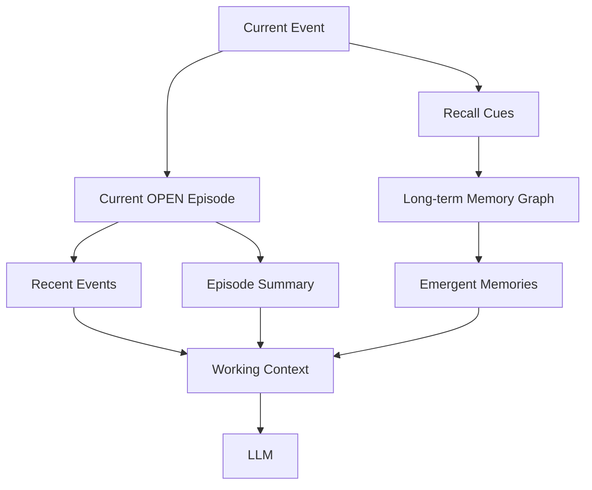
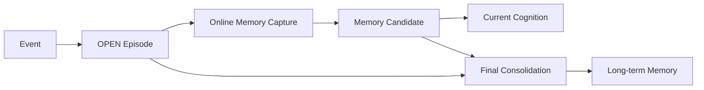
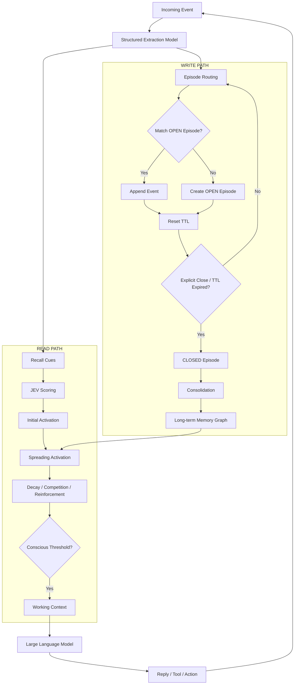
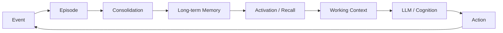

# Agent Memory：概念与流程图

> 仅保留当前讨论中已经出现并形成共识或阶段性共识的概念与流程。

---

# 1. 核心概念

## 1.1 Memory Loop

```text
Experience
→ Encode
→ Store
→ Activate
→ Recall
→ Cognition
→ Action
→ New Experience
```



---

# 2. 两类基础 Memory

## 2.1 Semantic Memory

> 世界是什么样。

典型内容：

```text
事实
属性
关系
稳定结论
概念结构
```

示例：

```text
JEV --IS_A--> Scoring Model
Episode --HAS--> TTL
```

## 2.2 Episodic Memory

> 世界发生过什么。

```text
Event
= 一次发生

Episode
= 一段语义连续的经历

Episodic Memory
≈ 被 Consolidate 后的 Episode
```

---

# 3. Event

```text
Event
= Agent 当前接收到或产生的一次发生
```

例如：

```text
用户消息
群聊消息
工具结果
Agent Action
状态变化
```

---

# 4. Episode

## 4.1 定义

> Episode 是语义线程，不是简单时间切片。

例如：

```text
时间顺序：
A1 → A2 → B1 → B2 → A3

Episode A：
A1 → A2 ─────────→ A3

Episode B：
          B1 → B2
```

## 4.2 当前最小状态

```text
OPEN
CLOSED
```

含义：

```text
OPEN
= Episode 仍在生长，可以继续接收 Event

CLOSED
= Episode 停止生长，准备进入 Consolidation
```

## 4.3 当前最小结构

```text
Episode
├── id
├── status: OPEN | CLOSED
├── summary
├── events[]
├── relevant_state
└── expires_at
```

`relevant_state` 是否必须保留，可继续压缩。

---

# 5. Episode Routing

> 判断新 Event 是否属于当前某个 OPEN Episode。



---

# 6. TTL

## 6.1 定义

> Episode TTL 以天为单位，用于判断一段 Episode 是否长期没有继续发生。

例如：

```text
TTL = 7 days
```

## 6.2 TTL Reset

```text
New Event
↓
匹配 OPEN Episode
↓
Append Event
↓
Reset TTL
```

示例：

```text
9/20 创建 Episode
expires_at = 9/27

9/23 再次匹配
expires_at = 9/30

9/28 再次匹配
expires_at = 10/05
```

## 6.3 TTL Expired

当前阶段：

```text
TTL expired
→ OPEN → CLOSED
→ Consolidation
→ Long-term Memory
```

TTL 不是删除机制。

---

# 7. Explicit Close

Episode 也可以在 TTL 到期之前明确结束。

```text
“就这么定了”
“这个问题解决了”
“这一版先到这里”
“下个版本再继续”
```

流程：

```text
OPEN
↓
Explicit Close
↓
CLOSED
↓
Consolidation
```

---

# 8. Episode Lifecycle



---

# 9. Episode Write Path



---

# 10. Consolidation

> 回答：这一整段经历最终应该留下什么。

```text
CLOSED Episode
↓
Structured Extraction
↓
Nodes
Relations
Relevant State
↓
JEV Scoring
↓
Code Reconciliation
↓
Long-term Memory
```



---

# 11. Structured Extraction Model

> 小型结构化模型，负责整理与抽取。

任务可以通过不同 schema 实现：

```text
extract_cues
extract_relations
summarize_episode
extract_state_change
```

基本形式：

```text
Natural Language
↓
Constrained Structured Representation
```

职责：

```text
整理
抽取
结构化
归纳
```

---

# 12. JEV / Scoring Model

> Context-conditioned Scoring Model。

形式：

```text
score = f(State, Question, Candidate)
```

用途：

```text
Episode Membership
Recall Cue Significance
Relation Confidence
Memory Surface Judgment
Commit Judgment
```

职责：

```text
模糊判断
语义评分
候选评价
```

---

# 13. Code

> 确定性的东西由 Code 处理。

包括：

```text
timestamp
elapsed time
TTL
counter
normalization
threshold comparison
graph traversal
decay equation
```

---

# 14. Recall Cue

> 能够触发已有认知结构的最小语义线索。

类型可能包括：

```text
ENTITY
CONCEPT
RELATION
STATE
ACTION
GOAL
TEMPORAL
MODALITY
```

示例：

```text
输入：
“JEV 可以参与 Memory Activation”

Recall Cues：
ENTITY: JEV
CONCEPT: Memory Activation
RELATION: JEV → MODULATES → Memory Activation
```

---

# 15. Activation Budget

Recall Cue 可以分配初始 Activation Weight。

```text
Σ wi = 1
```

这里表示：

```text
Activation Budget
```

而不是严格概率。

---

# 16. Memory Emergence

> 当前状态先激活部分认知对象，Activation 沿关系传播，受到衰减、强化和竞争影响，最终部分 Memory 跨过阈值进入 Working Context。

```text
Current State
→ Recall Cues
→ Initial Activation
→ Cognitive Graph
→ Spreading Activation
→ Decay / Reinforcement / Competition
→ Conscious Threshold
→ Working Context
```

---

# 17. Read Path



---

# 18. Retrieval vs Emergence

```text
Retrieval
= 去数据库里找什么？

Emergence
= 当前认知状态最终让什么自己浮上来？
```

---

# 19. Cognitive / Memory Graph

可能包含：

```text
Memory
Episode
Event
Entity
Concept
State
```

---

# 20. Relation Types

当前讨论过的关系类型：

```text
CAUSES
CAUSED_BY
CONTRASTS_WITH
SIMILAR_TO
BEFORE
AFTER
NEXT
PART_OF
CONTAINS
ABOUT
IS_A
ENABLES
MODULATES
CONFLICTS_WITH
```

---

# 21. Relation Edge

```text
Relation Edge
├── Semantic Payload
└── Mechanical State
```

## 21.1 Semantic Payload

```text
relation_type
description
rationale
context
notes
exceptions
hypothesis
decision
```

## 21.2 Mechanical State

```text
confidence
association_strength
timestamps
counters
```

---

# 22. Rich Semantics + Minimal Mechanics

```text
Semantic Layer
= 可以丰富

Mechanical Layer
= 必须极简、稳定、可计算
```

---

# 23. Confidence

> 这条关系有多可信？

```text
Confidence
= Epistemic state
```

---

# 24. Association Strength

> 想到 A 时，有多容易联想到 B？

```text
Association Strength
= Long-term associative state
```

它可以动态变化。

---

# 25. Activation

> 某个认知对象此刻有多活跃？

```text
Activation
= Runtime cognitive state
```

因此：

```text
Confidence
≠
Association Strength
≠
Activation
```

---

# 26. Association Strength Dynamics

讨论过的粗略方向：

```text
co-activation
→ strength ↑

long-term inactivity
→ strength ↓
```

形式示意：

```text
sAB(t+1)
=
λ · sAB(t)
+
η · AA · AB
```

尚未定稿。

---

# 27. Fast / Slow Dynamics

```text
Fast Dynamics
= Activation

Slow Dynamics
= Association Strength
```

---

# 28. Contrast 与 Inhibition

```text
CONTRASTS_WITH
= 一种语义关系
```

可能仍然传播 Activation。

```text
Inhibition
= Runtime Competition
```

用于决定哪些对象最终进入 Working Context。

二者不同。

---

# 29. Working Context

> 当前真正进入 LLM 推理范围的少量认知对象。

```text
Memory Graph
↓
Activation
↓
Threshold
↓
Working Context
↓
LLM
```

---

# 30. Long-term Memory Graph

来源：

```text
CLOSED Episode
↓
Consolidation
↓
Long-term Memory Graph
```

作用：

```text
为未来 Recall / Activation 提供长期认知结构
```

---

# 31. Current Episode 与 Long-term Memory

当前认知可能同时依赖：

```text
Current Episode
+
Long-term Memory
```

概念图：



---

# 32. OPEN Episode 中的 Memory Candidate

这是当前未定稿概念。

问题：

```text
Episode 还没有 CLOSED
但期间已经出现值得记忆的信息
```

候选方案：

```text
Episode
├── events[]
└── memory_candidates[]
```

可能结构：

```text
MemoryCandidate
├── content
├── source_event_ids[]
└── score
```

概念流程：



当前状态：

```text
Open Issue
尚未进入 P0 定稿
```

---

# 33. Embedding / Reranker

当前定位：

```text
Embedding / Reranker
= Optional Scale Optimization
```

不是当前 Cognitive Core。

未来可能用于：

```text
Candidate Prefilter
Entity Index
Vector Index
BM25
Temporal Index
Graph Index
```

---

# 34. 当前模型分工

```text
Structured Extraction Model
= 整理

JEV / Scoring Model
= 评分

Memory Dynamics Engine
= 联想 / 演化

Large Language Model
= 思考 / 生成
```

---

# 35. 图书馆类比

```text
Structured Extraction Model
= 图书管理员

JEV
= 馆藏评估员

Memory Graph + Dynamics
= 图书馆

Working Context
= 阅览桌

LLM
= 研究者
```

---

# 36. 总体 Workflow



---

# 37. 最简 Memory Loop



---

# 38. 当前 P0 核心

```text
Event
Episode
OPEN / CLOSED
TTL
Structured Extraction Model
JEV
Consolidation
Long-term Memory Graph
Recall Cues
Activation
Spreading Activation
Threshold
Working Context
LLM
```

---

# 39. 当前未定稿项

```text
OPEN Episode 期间的重要 Memory 如何在线保存
Episode Routing 最小 Contract
TTL 的具体天数
Consolidation 最小 Schema
Relation Types 最小集合
Activation 传播公式
Association Strength 更新规则
Conscious Threshold
Semantic Memory 如何从多个 Episode 中长期形成
```

---

# 40. 一句话总结构

```text
Event
→ Episode
→ TTL / Explicit Close
→ Consolidation
→ Long-term Memory

Current Event
→ Recall Cues
→ JEV
→ Activation
→ Memory Graph
→ Emergence
→ Working Context
→ LLM
→ Action
→ New Event
```

> 小模型整理，JEV 评分，Memory Dynamics 联想，LLM 思考。
