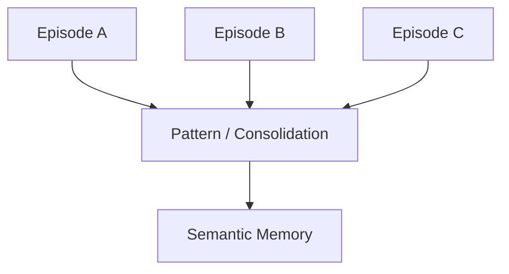
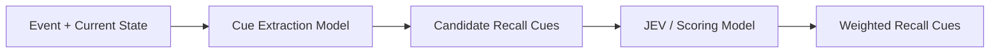
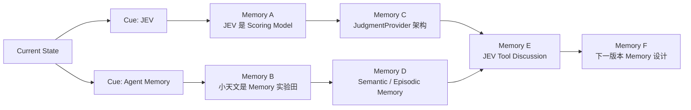
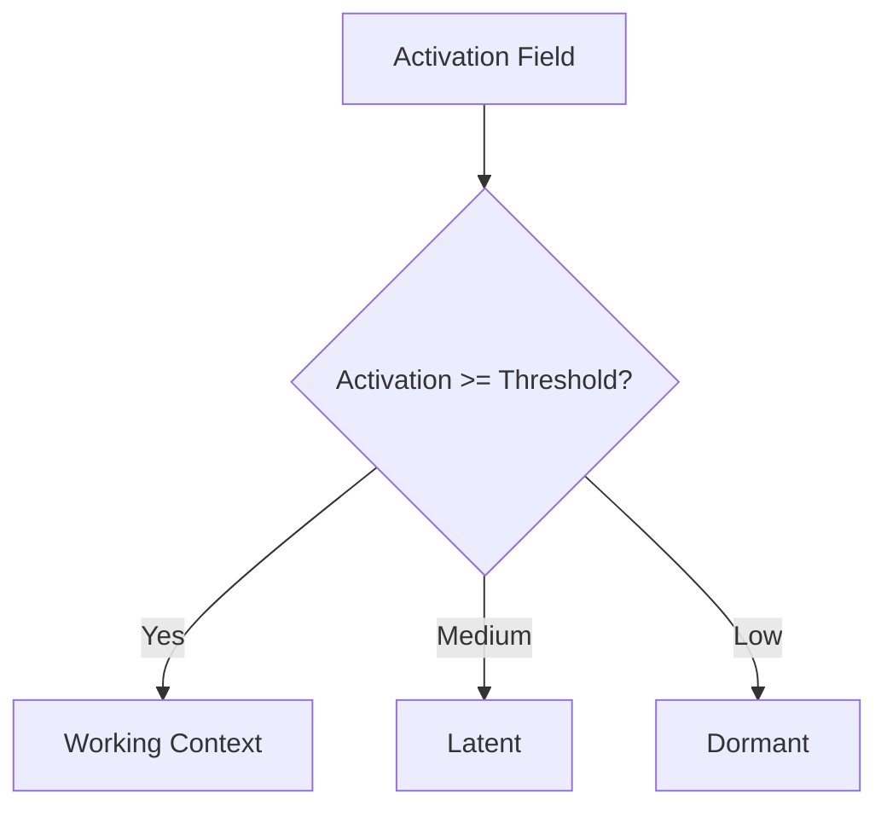
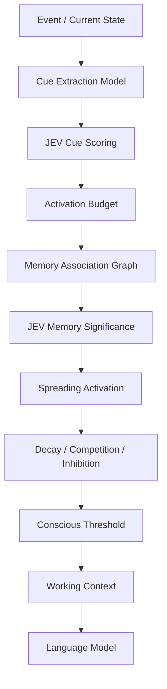
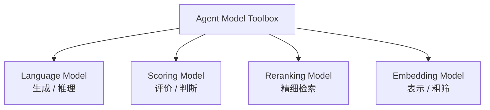
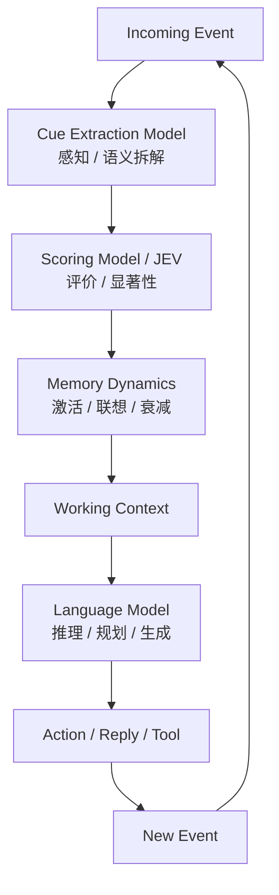
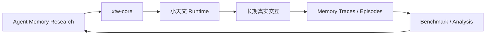
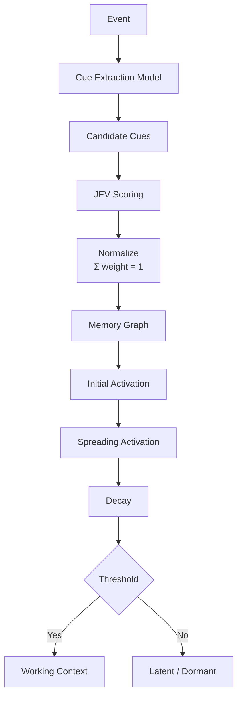

# Agent Memory 最新讨论结果备忘

> 状态：当前讨论收束版  
> 主题：JEV、Cue Extraction Model 与涌现式记忆  
> 目标：明确当前已经形成的架构共识，作为后续实验与 xtw-core 设计基础。

---

## 0. 当前最核心的结论

目前的 Agent Memory 设计，不再采用传统的：

```text
Query
↓
Embedding
↓
Vector Search
↓
Reranker
↓
Top-K Memory
↓
LLM
```

作为核心认知机制。

当前更认可的模型是：

```text
Event / Current State
        ↓
Cue Extraction
        ↓
Cue Scoring
        ↓
Initial Activation
        ↓
Memory Association Graph
        ↓
Spreading Activation
        ↓
Decay / Competition / Inhibition
        ↓
Conscious Threshold
        ↓
Working Context
        ↓
Language Model
```

核心思想是：

> **记忆不是“查出来”的，而是在当前状态刺激下被逐步激活，并通过关联传播，最终部分记忆跨过意识阈值而“浮现”。**

因此：

```text
Memory Retrieval
≠
Memory Emergence
```

---

# 1. 记忆分为两种

当前先采用两种基础记忆类型。

## 1.1 Semantic Memory：知识性记忆

知识性记忆描述：

> **世界是什么样。**

典型结构接近：

```text
主语 + 系词 / 关系 + 表语
```

例如：

```text
JEV 是一种 Scoring Model。
小天文是 Agent Memory 的实验田。
0.1.0 是已经完成 demo 的版本。
```

形式上可以表示为：

```text
Subject
  ↓
Relation
  ↓
Object / Value
```

例如：

```json
{
  "subject": "JEV",
  "relation": "is_a",
  "object": "ScoringModel"
}
```

Semantic Memory 更接近：

```text
事实
属性
关系
当前稳定状态
```

---

## 1.2 Episodic Memory：时间记忆

时间记忆描述：

> **世界发生过什么。**

单个事件可以采用：

```text
主语 + 谓语 + 宾语
```

例如：

```text
用户 → 提出 → 将 JEV 注册为 Tool
用户 → 决定 → 将该讨论留到下一版本
```

但 Episodic Memory 的基本单位不应是一条 Event，而应是一段：

```text
Episode
```

例如：

```text
提出方案
↓
讨论方案
↓
发现问题
↓
形成判断
↓
做出决定
```

因此：

```text
Event ≠ Episodic Memory
Episode ≈ Episodic Memory Unit
```

---

# 2. Semantic Memory 与 Episodic Memory 的关系

两者不是完全独立的。

多个 Episode 可以经过长期 consolidation，沉淀成 Semantic Memory：



例如：

```text
Episode A：
用户要求先给中文架构表

Episode B：
用户再次要求先给中文架构表

Episode C：
用户明确反馈这种方式更容易理解
```

最终可能沉淀为：

```text
用户的架构表达偏好
=
中文架构表优先
```

因此：

> **Semantic Memory 可以是 Episodic Memory 长期抽象后的稳定知识。**

---

# 3. 当前不再使用“关键词”这个概念

传统“关键词提取”太弱。

当前更准确的概念是：

```text
Recall Cue
```

即：

> **能够触发旧认知结构的最小语义线索。**

Recall Cue 不只是名词。

它可以包括：

```text
ENTITY
CONCEPT
RELATION
STATE
ACTION
GOAL
TEMPORAL
MODALITY
```

例如：

```text
Event:
“JEV 也许可以直接参与记忆的激活。”
```

可以拆成：

```json
{
  "cues": [
    {
      "type": "ENTITY",
      "value": "JEV"
    },
    {
      "type": "CONCEPT",
      "value": "memory activation"
    },
    {
      "type": "RELATION",
      "subject": "JEV",
      "predicate": "participate_in",
      "object": "memory activation"
    },
    {
      "type": "MODALITY",
      "value": "hypothesis"
    }
  ]
}
```

---

# 4. Cue Extraction Model

当前认为 Recall Cue 提取不应该交给主 LLM 长期承担。

这是一个：

```text
高频
结构固定
输出空间有限
不需要复杂推理
```

的任务。

因此适合做一个类似 JEV 的专用小模型。

暂定角色：

```text
Cue Extraction Model
```

它负责：

> **看懂当前 Event，并把它分解成结构化 Recall Cues。**

而不负责：

```text
这个 Cue 是否重要
这个 Cue 应该获得多少激活
应该想起什么
应该采取什么行动
```

---

## 4.1 Cue Extraction Model 的输入输出

```text
Current State
+
Event
        ↓
Cue Extraction Model
        ↓
RecallCue[]
```

例如：

```json
{
  "event": "JEV 也许可以直接参与记忆的激活。"
}
```

输出：

```json
{
  "cues": [
    {
      "type": "ENTITY",
      "value": "JEV"
    },
    {
      "type": "CONCEPT",
      "value": "memory activation"
    },
    {
      "type": "RELATION",
      "value": "JEV -> modulate -> memory activation"
    }
  ]
}
```

---

# 5. JEV 的当前定义

JEV 不再只理解为：

```text
YES / NO classifier
```

更准确的定义是：

> **JEV 是一个 context-conditioned scoring model。**

形式化：

$$
s = f(S,Q,O)
$$

其中：

```text
S = State
Q = Question
O = Option / Candidate
s = Score
```

YES / NO 只是最简单的特例。

例如：

```text
State:
当前正在讨论 Agent Memory

Question:
这个 Recall Cue 是否值得获得较高的初始激活？

Option:
JEV -> modulate -> memory activation
```

输出：

```text
YES = 0.94
NO  = 0.06
```

---

# 6. Cue Extraction Model 与 JEV 的分工

这是当前非常重要的一层分离：



两者职责分别是：

```text
Cue Extraction Model
=
“这里说了什么？”
```

```text
JEV
=
“这些东西现在有多值得？”
```

也就是：

```text
Perception / Semantic Decomposition
        ↓
Evaluation
```

这两件事不要混在一个模型里。

---

# 7. Cue Weight / Activation Budget

Cue Extraction Model 只负责产生候选 Cue。

JEV 再负责给候选 Cue 打分。

例如：

```text
JEV                                  0.95
memory activation                    0.94
JEV -> modulate -> memory activation 0.97
agent memory                         0.72
model                                0.18
system                               0.09
```

之后由 Code 做：

```text
threshold
+
normalization
```

得到：

```text
JEV                                  0.27
memory activation                    0.27
JEV -> modulate -> memory activation 0.28
agent memory                         0.18
```

满足：

$$
\sum_i w_i = 1
$$


这里的 \(w_i\) 不应称为概率。

更准确的名称是：

```text
Activation Weight
```

或者：

```text
Activation Budget
```

即：

> 当前 Event 能够向整个记忆网络注入的有限初始认知激活。

---

# 8. 记忆的初始激活

Recall Cue 进入 Memory System 后，会给相关记忆节点注入 Initial Activation。

简单形式可以写成：

$$
A_0(M_j)
=
\sum_i w_i r(C_i,M_j)
$$
其中：

```text
C_i = Recall Cue
w_i = Cue Activation Weight
M_j = Memory
r(C_i, M_j) = Cue 与 Memory 的关联程度
```

如果加入 JEV 对 Memory 本身的 Significance 判断：

$$
A_0(M_j)
=
\sum_i w_i r(C_i,M_j)
+
\beta \cdot JEV(S,M_j)
$$
因此：

> **JEV 可以既参与 Cue Scoring，也可以参与 Memory Significance Scoring。**

是否需要两层都跑 JEV，需要后续 benchmark 决定。

---

# 9. 真正的涌现：Spreading Activation

只激活一个 Memory 还不够。

真正接近人类回忆的地方是：

> **被激活的 Memory 会继续激活其他 Memory。**

例如：



Memory F 可能并没有被当前 Event 直接命中。

但它可以通过多条关联路径逐渐得到 Activation：

```text
0.18
↓
0.32
↓
0.49
↓
0.73
```

最终跨过意识阈值。

于是它表现为：

> “突然想起了另外一件事。”

---

# 10. 涨落而不是一次打分

Memory Activation 是动态状态。

不是：

```text
score once
→ top-k
```

而是：

```text
initial activation
↓
propagation
↓
decay
↓
new activation
↓
propagation
↓
competition
↓
stabilization
```

可以暂时表示为：

$$
A_i(t+1)
=
\lambda A_i(t)
+
Cue_i
+
Association_i
+
\beta JEV_i
-
Inhibition_i
$$

其中：

```text
λA_i(t)
= 上一时刻激活经过衰减后的剩余部分

Cue_i
= 当前 Event 的直接刺激

Association_i
= 其他 Memory 传播过来的激活

JEV_i
= 当前 State 下该对象的 Significance

Inhibition_i
= 竞争对象产生的抑制
```

---

# 11. Decay：遗忘

如果没有 Decay：

```text
Memory A
→ Memory B
→ Memory C
→ Memory D
→ ...
```

最终会把整个 Memory Graph 点亮。

因此每一轮必须衰减。

最简单：

$$
A_i(t+1)=\lambda A_i(t)
$$


其中：

```text
0 < λ < 1
```

例如：

```text
0.80
↓
0.64
↓
0.51
↓
0.41
↓
0.33
```

因此：

> **遗忘首先不是删除记忆，而是失去当前激活。**

Memory 仍然存在，只是暂时无法浮现。

---

# 12. Competition / Inhibition

Working Context 是有限的。

所以多个 Activated Memory 不能无限制进入 Context。

需要：

```text
Competition
+
Inhibition
```

最终形成一个较稳定的 Activation Distribution：

```text
Memory A  ██████████  0.91
Memory B  ████████    0.82
Memory C  ███████     0.73
Memory D  █████       0.52
Memory E  ██          0.19
```

---

# 13. Conscious Threshold

当 Memory 的 Activation 跨过：

```text
Conscious Threshold
```

它才真正进入：

```text
Working Context
```

例如：

```text
threshold = 0.70

M1 = 0.91 → Conscious
M2 = 0.82 → Conscious
M3 = 0.73 → Conscious
M4 = 0.52 → Latent
M5 = 0.19 → Dormant
```

因此：



---

# 14. “涌现”的当前正式定义

当前可以把 Memory Emergence 定义为：

> **当前状态首先产生 Recall Cues，并向部分认知对象注入初始激活；激活随后沿 Memory Association Graph 传播，并受到衰减、竞争和抑制影响；最终，一些原本不在当前上下文中的 Memory 因为多个局部激活共同作用而跨过意识阈值，进入 Working Context。**

因此：

```text
Memory Retrieval
=
“去数据库里找什么？”
```

而：

```text
Memory Emergence
=
“当前认知状态最终让什么自己浮了上来？”
```

---

# 15. 当前 Memory P0 不需要 Embedding 和 Reranker

这是最新讨论中一个重要修正。

此前考虑过：

```text
Embedding
↓
Reranker
↓
JEV
↓
Activation
```

但当前认为：

> **这仍然带有传统 RAG Pipeline 的惯性。**

对于第一版 Emergent Memory P0，更值得直接验证：



也就是说：

```text
核心 Memory 机制：

Cue Extraction Model
+
Scoring Model / JEV
+
Memory Dynamics
+
Language Model
```

---

# 16. Embedding / Reranker 的新定位

Embedding 与 Reranker 仍然是 Agent 中有价值的模型能力。

但它们不再是 Memory Emergence 的必需组成部分。

当前定位为：

```text
Optional Candidate Prefilter
```

例如，当未来存在：

```text
1,000,000 memories
```

不可能全部跑 JEV。

这时可以加入：

```text
Vector Search
Entity Index
BM25
Graph Neighborhood
Temporal Filter
Metadata Filter
Reranker
```

用于：

> **减少需要进入 JEV / Activation System 的候选数量。**

因此它们属于：

```text
Scale Optimization
```

而不是：

```text
Cognitive Core
```

---

# 17. 四类模型能力仍然成立

虽然 Memory P0 不一定使用全部四类模型，但 Agent 的模型工具箱仍然可以分成：

```text
1. Language Model
2. Scoring Model
3. Reranking Model
4. Embedding Model
```

它们不是固定四步 Pipeline。

而是：



不同子系统按需调用。

---

# 18. 当前认知模型分工

现在 Agent 更接近：

```text
专用小模型
+
评分模型
+
状态动力学
+
大语言模型
```

而不是：

```text
一个大 LLM
+
一堆 Tool
```

当前可以画成：



可以粗略理解为：

```text
System-1 side
----------------
Cue Extraction Model
JEV / Scoring Model
Memory Activation
Decay / Competition

        ↓

Working Context

        ↓

System-2 side
----------------
Language Model
Reasoning
Planning
Generation
```

---

# 19. 小天文的定位

小天文当前不是最终产品目标。

当前更准确的定位是：

> **Agent Memory 的长期实验田。**

它负责提供真实持续交互环境，用来观察：

```text
Episode 如何形成
Semantic Memory 如何沉淀
Recall Cue 是否合理
JEV 是否能控制 Significance
Activation 是否会失控
Memory 是否会错误浮现
长期运行后是否出现稳定认知结构
```

因此：



---

# 20. 当前建议的 Provider 抽象

## CueExtractionProvider

```python
class CueExtractionProvider:
    def extract(
        self,
        event: NormalizedEvent,
        state: AgentState,
    ) -> list[RecallCue]:
        ...
```

可能实现：

```text
SmallModelCueProvider
LLMCueProvider
RuleBasedCueProvider
```

---

## ScoringModelProvider

```python
class ScoringModelProvider:
    def score(
        self,
        state,
        question,
        option,
    ) -> float:
        ...
```

JEV：

```text
JEVScoringProvider
implements
ScoringModelProvider
```

---

## LanguageModelProvider

负责：

```text
reasoning
planning
generation
structured output
```

---

# 21. RecallCue 暂定结构

可以先定义：

```python
RecallCue:
    type:
        ENTITY
        CONCEPT
        RELATION
        STATE
        ACTION
        GOAL
        TEMPORAL
        MODALITY

    value: str
    weight: float
```

关系类型未来可以进一步结构化：

```python
RelationCue:
    subject: str
    predicate: str
    object: str
    weight: float
```

---

# 22. 当前最小实验版本：Memory P0

第一版不要做完整认知系统。

只验证：

```text
Cue
↓
Activation
↓
Propagation
↓
Decay
↓
Threshold
```

建议：



第一版甚至可以暂时不做：

```text
Embedding
Reranker
复杂 Inhibition
Semantic Consolidation
自动 Episode Segmentation
百万级 Memory
```

---

# 23. 后续 Benchmark

建议逐层做 ablation。

## Recall Core

```text
A:
Graph only

B:
Graph + JEV

C:
Graph + JEV + Decay

D:
Graph + JEV + Decay + Competition
```

观察：

```text
Recall Precision
Recall False Positive
Useful Emergence
Irrelevant Emergence
Context Pollution
Latency
```

---

## Candidate Prefilter

Memory 数量扩大后再测试：

```text
A:
All Memory → JEV

B:
Embedding → JEV

C:
Graph Neighborhood → JEV

D:
Embedding → Reranker → JEV

E:
Entity / Temporal / Graph Hybrid → JEV
```

此时才能回答：

> Emergent Memory 是否真的需要传统 Retrieval Pipeline？

---

# 24. 当前最重要的概念边界

## Cue

> 当前事件中能够触发旧认知结构的最小语义线索。

## Significance

> 当前 State 下，一个 Cue / Memory / Candidate 值得被进一步处理的程度。

## Activation

> 一个认知对象在当前动态记忆系统中的实时活跃程度。

## Emergence

> Activation 经由传播、衰减、竞争后，使原本不在上下文中的对象跨过意识阈值。

## Working Context

> 当前 Activation Field 中真正浮到意识层、供 LLM 使用的一小部分对象。

---

# 25. 当前架构的一句话总结

```text
Cue Model 负责“看见什么”。

JEV 负责“什么值得注意”。

Memory Dynamics 负责“什么最终浮现”。

LLM 负责“对浮现出来的东西怎么思考和行动”。
```

进一步压缩：

> **Perception → Evaluation → Emergence → Cognition**

这是当前讨论形成的最核心 Agent Memory Workflow。
