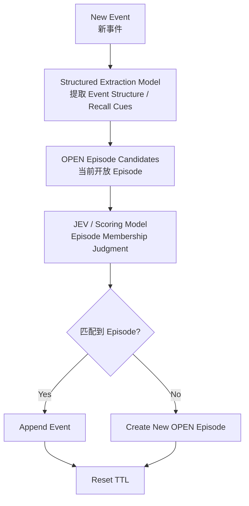
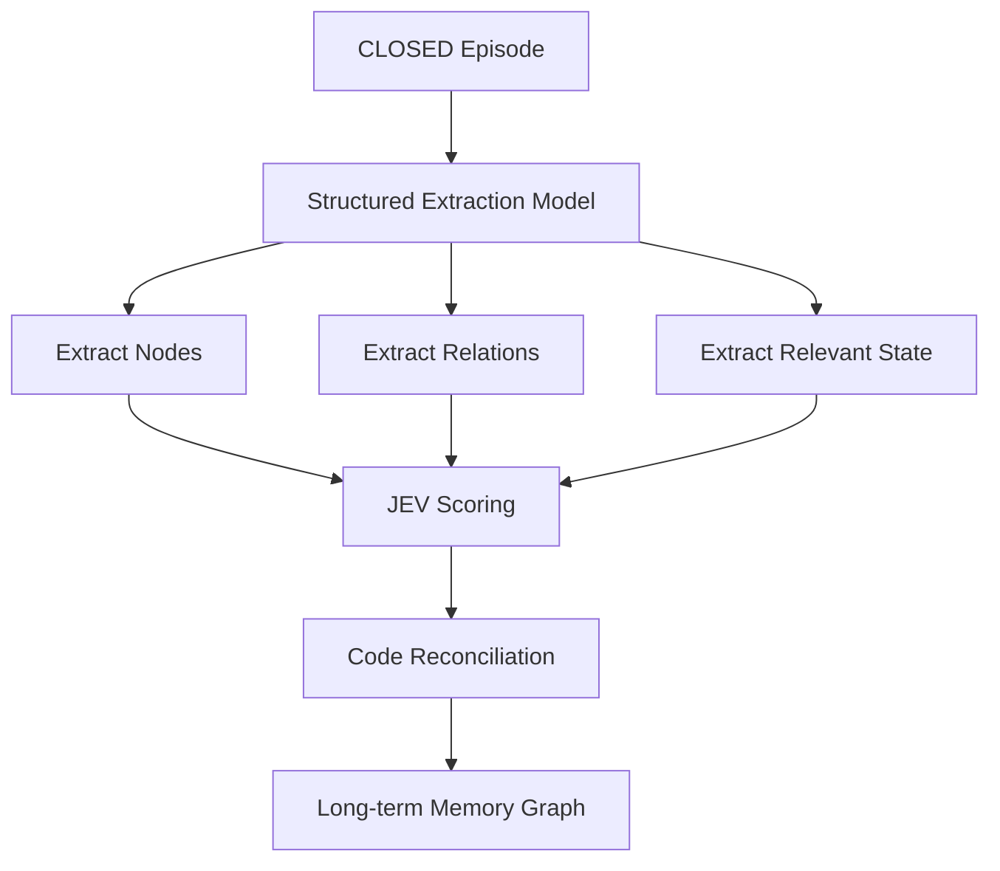
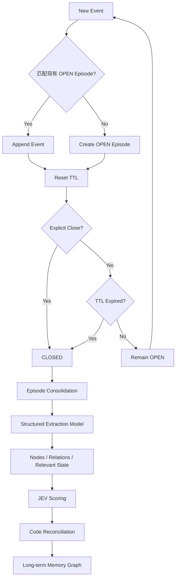
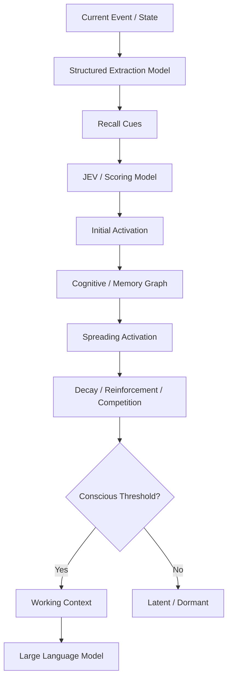
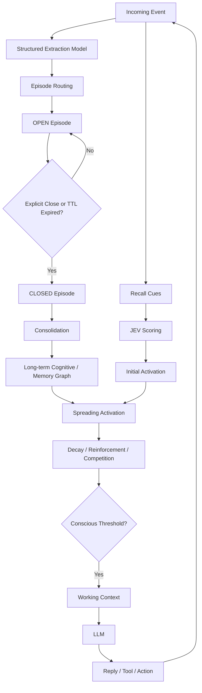
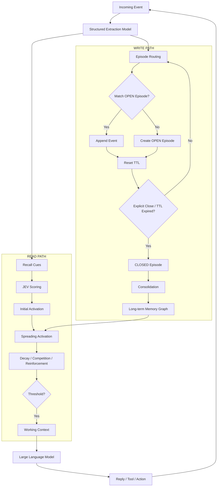

# Agent Memory 今日讨论完整整理

> 用途：阶段性研究笔记 / iPad 批注稿  
> 主题：Agent Memory 的写入、读取、Episode、TTL、Consolidation、Emergent Recall、JEV / Structured Extraction Model 分工  
> 状态：**阶段性收束，尚非最终设计**  
> 目标：把今天讨论过的想法、修正过程、当前共识与未决问题完整保留下来，方便后续继续推演。

---

# 0. 今天到底解决了什么？

今天最重要的进展，不是确定了某个具体参数，而是把整个 Memory System 从一堆散点，推进成了一个**完整闭环**：

```text
Experience
→ Encode
→ Store
→ Activate
→ Recall
→ Cognition
→ Action
→ New Experience
```

对应到 Agent：

```text
事件发生
↓
组织成 Episode
↓
Episode 被整理 / 固化
↓
进入长期记忆
↓
未来当前状态触发 Recall
↓
记忆通过 Activation 浮现
↓
进入 Working Context
↓
LLM 推理 / 行动
↓
产生新的 Event
```

最终得到两个核心路径：

```text
WRITE PATH
写入路径
```

和：

```text
READ PATH
读取路径
```

二者共同构成：

```text
MEMORY LOOP
```

---

# 1. 今天形成的最核心结论

先把所有重要结论压缩成一页。

## 1.1 Memory 不是单纯 Retrieval

传统记忆方案：

```text
query
→ embedding search
→ top-k memories
→ context
```

今天更明确地倾向于：

```text
Current State / Event
→ Recall Cues
→ Initial Activation
→ Cognitive / Memory Graph
→ Spreading Activation
→ Decay / Competition / Reinforcement
→ Threshold
→ Working Context
```

因此：

> **Recall 不应只理解成 Search，而应理解成 Memory Emergence。**

也就是：

> 当前认知状态最终让什么“自己浮上来”。

---

## 1.2 Memory 写入与读取不是对称的数据库 I/O

写入端问：

> **“这段经历最后留下了什么？”**

读取端问：

> **“当前状态让什么重新浮现？”**

两者不同，但正好闭环。

---

## 1.3 Episode 是语义线程，不是简单时间切片

群聊中：

```text
A1
A2
B1
B2
A3
```

可能实际是：

```text
Episode A:
A1 → A2 ─────→ A3

Episode B:
          B1 → B2
```

所以：

> **Episode 更像语义上的经历线程，而不是连续的一段时间。**

---

## 1.4 Episode 当前最简生命周期

复杂状态曾经考虑过：

```text
ACTIVE
SUSPENDED
CLOSED
ACHIEVED
FAILED
DEFERRED
UNRESOLVED
...
```

今天逐渐认为这太复杂。

当前更倾向于：

```text
OPEN
CLOSED
TTL
```

解释：

```text
OPEN
= Episode 还在生长，还能继续接收 Event

CLOSED
= Episode 停止生长，进入 Consolidation

TTL
= 如果连续一段时间没人继续这个 Episode，则自然 CLOSED
```

---

## 1.5 TTL 当前定义

TTL 以“天”为单位。

例如：

```text
episode_ttl = 7 days
```

规则：

```text
New Event matches OPEN Episode
→ append
→ reset TTL
```

如果持续有人继续：

```text
TTL 不断续命
```

如果连续 N 天没有 Event：

```text
TTL expired
→ CLOSED
→ Consolidation
→ Long-term Memory
```

因此：

> **TTL 不是删除机制，而是自然结束 Episode 的机制。**

---

## 1.6 CLOSED 不等于“问题解决”

这是今天很重要的简化。

`CLOSED` 不需要意味着：

```text
ACHIEVED
FAILED
DEFERRED
UNRESOLVED
```

它只意味着：

> **这一段经历已经停止继续生长，可以进入长期记忆整理。**

至于事情最后：

```text
解决了
失败了
延期了
不了了之
```

这些可以保存在语义内容里，而不必都变成机械状态字段。

---

## 1.7 Structured Extraction Model 与 JEV 的职责已经区分

### Structured Extraction Model

负责：

```text
整理
结构化
抽取
归纳
```

例如：

```text
extract_cues
extract_relations
summarize_episode
extract_state_change
```

本质：

```text
Natural Language
→ Constrained Structured Representation
```

类比：

> **图书管理员**

---

### JEV / Scoring Model

负责：

```text
模糊判断
评分
评价候选
```

例如：

```text
这个 Event 属于哪个 Episode？
这个 Recall Cue 重要吗？
这条关系可信吗？
这段 Memory 现在值得浮现吗？
```

本质：

```text
score = f(State, Question, Candidate)
```

类比：

> **馆藏评估员**

---

## 1.8 Code 只做确定的事情

继续沿用之前 JEV 设计中的原则：

```text
timestamp
elapsed time
TTL
counter
normalization
threshold comparison
graph traversal
decay equation
```

都应该由：

```text
Code
```

处理。

而：

```text
是否属于同一 Episode
关系是否可信
当前是否值得激活
语义上是否相关
```

交给：

```text
JEV / Scoring Model
```

---

## 1.9 长期记忆对象的原则

今天反复收敛到：

> **Rich Semantics + Minimal Mechanics**

即：

```text
语义可以丰富
参数必须克制
```

不要为了让系统“看起来结构化”，把所有东西都变成字段。

---

# 2. 两类基础 Memory

---

## 2.1 Semantic Memory

回答：

> **世界是什么样。**

例如：

```text
JEV --IS_A--> Scoring Model
```

```text
Episode --HAS--> TTL
```

Semantic Memory 主要承载：

```text
事实
属性
关系
稳定结论
概念结构
```

---

## 2.2 Episodic Memory

回答：

> **世界发生过什么。**

Event 是基础发生单元，但 Episodic Memory 更适合以：

```text
Episode
```

为单位。

例如：

```text
提出设计
→ 发现问题
→ 修正方案
→ 得出阶段性结论
```

所以：

```text
Event
= 一次发生

Episode
= 一段经历

Episodic Memory
≈ 被 Consolidate 后的 Episode
```

---

# 3. 为什么需要 Episode？

如果直接把所有 Event 写进长期记忆：

```text
Event 1
Event 2
Event 3
...
```

会出现几个问题：

1. 语义上下文被切碎；
2. 过程中的中间方案和最终结论混在一起；
3. 同一件事被分散成大量孤立 Memory；
4. 无法表达“这一整段经历最终意味着什么”。

所以 Episode 的意义是：

> **把多个 Event 组织成一个语义连续的经历单元。**

---

# 4. Episode 不是时间切片

群聊尤其明显。

例如：

```text
A：Agent Memory 怎么组织？
B：我觉得用 Episode。
C：今晚吃啥？
D：火锅吧。
A：对了，刚刚那个 Episode，我觉得还需要 TTL。
```

时间顺序：

```text
Memory
Memory
Dinner
Dinner
Memory
```

但 Episode 应该是：

```text
Episode A — Agent Memory
├── Event 1
├── Event 2
└── Event 5

Episode B — Dinner
├── Event 3
└── Event 4
```

因此：

> **短暂话题切换不能自动结束 Episode。**

---

# 5. Episode Routing

新 Event 来时，需要做：

```text
New Event
↓
寻找近期 OPEN Episodes
↓
判断属于哪个 Episode
```

核心问题：

> **“这个 Event 是否是在继续某条已有语义线程？”**

当前第一版不需要：

```text
搜索全部历史 Episode
```

只需要考虑：

```text
当前仍 OPEN 的 Episodes
```

因为 CLOSED Episode 已经进入长期记忆。

---

## 5.1 Routing 流程



---

# 6. Episode TTL

TTL 是今天对 Episode 复杂度进行压缩后留下的关键机制。

---

## 6.1 TTL 的含义

当前更合理的定义：

> **一个 Episode 连续多少天没有新的 Event 被归入，就认为这段经历自然结束。**

例如：

```text
TTL = 7 days
```

---

## 6.2 新 Event 会 Reset TTL

例如：

```text
9/20
创建 Episode A

expires_at = 9/27
```

9/23 又出现相关 Event：

```text
append Event
↓
expires_at = 9/30
```

9/28 又继续：

```text
append Event
↓
expires_at = 10/05
```

所以：

> **只要一件事仍在继续发生，这个 Episode 就继续活着。**

---

## 6.3 TTL 到期

如果一直没人继续：

```text
TTL expired
↓
OPEN → CLOSED
↓
Consolidation
↓
Long-term Memory
```

注意：

```text
TTL expired
≠ delete
```

而是：

```text
TTL expired
= 这段经历已经自然冷却，可以固化
```

---

# 7. Explicit Close 与 TTL Close

Episode 有两种结束方式。

---

## 7.1 Explicit Close

某些语义非常明确：

```text
“就这么定了。”
“这个问题解决了。”
“这一版先到这里。”
“下一版本再讨论。”
```

这种情况下：

```text
OPEN
↓
CLOSED
↓
Consolidation
```

---

## 7.2 TTL Close

没有明确结束语，但是长期没有继续：

```text
OPEN
↓
N 天无新 Event
↓
TTL expired
↓
CLOSED
↓
Consolidation
```

最终二者走同一条长期记忆写入路径。

---

# 8. Episode 当前最小结构

今天一开始提出过：

```text
Episode
├── id
├── summary
├── events[]
└── last_event_at
```

后来讨论 TTL 后，更自然的版本是：

```text
Episode
├── id
├── status: OPEN | CLOSED
├── summary
├── events[]
├── relevant_state
└── expires_at
```

其中：

```text
relevant_state
```

是否第一版必须存在，目前仍可再压缩。

甚至可以只保留：

```text
Episode
├── id
├── status
├── summary
├── events[]
└── expires_at
```

---

# 9. 为什么不要加太多状态？

曾经讨论过：

```text
ACTIVE
SUSPENDED
CLOSED
COLD
ARCHIVED

IN_PROGRESS
ACHIEVED
FAILED
DEFERRED
UNRESOLVED
SUPERSEDED
...
```

问题是：

> **这些字段会让系统开始管理“状态本身”，而不是管理 Memory。**

很多信息完全可以由：

```text
summary
semantic payload
relevant_state
```

表达。

例如：

```text
summary:
“当前方案暂缓，准备在下个版本继续。”
```

已经可以表达：

```text
DEFERRED
```

没必要一定再存：

```text
resolution_status = DEFERRED
```

---

# 10. Episode CLOSED 之后发生什么？

进入：

```text
Final Consolidation
```

流程：



---

# 11. Consolidation 的作用

它不是简单：

```text
Episode → summary
```

而是回答：

> **“这一整段经历，最终应该在长期记忆里留下什么？”**

例如一个 Episode 中：

```text
早期：
“Episode 可能需要 ACTIVE / SUSPENDED / CLOSED”

中期：
“也许还需要 ACHIEVED / FAILED”

后期：
“太复杂了，OPEN / CLOSED + TTL 就够”
```

最终 Long-term Memory 不应该把三套设计都当成当前事实。

Consolidation 应该得到：

```text
最终结论：
Episode P0 使用 OPEN / CLOSED + TTL。
```

而早期方案可以作为：

```text
历史过程
```

存在 Episode 内，但不必成为当前 Semantic Memory。

---

# 12. 今天遇到的新问题：Episode 没结束时怎么办？

这是今天最后暴露出来、但暂时决定不继续深入的问题。

问题：

> **如果一个 Episode 持续很多天，期间已经产生了明显值得记住的信息，难道必须等 Episode CLOSED 才能使用吗？**

显然不合理。

例如：

```text
“Confidence、Association Strength、Activation 必须分开。”
```

这个结论可能在 Episode 第一天就形成。

如果 Episode 一个月后才关闭：

```text
难道一个月内 Agent 都不能把它当记忆？
```

不合理。

---

# 13. 临时提出的 Memory Candidate 思路

为了解决上面的问题，提出过：

```text
Event
↓
Episode
↓
Online Memory Capture
↓
Memory Candidates
↓
Episode CLOSED
↓
Final Consolidation
↓
Long-term Memory
```

也就是：

> **Episode 期间允许“先记下来”，Episode 结束后再决定“最终记成什么”。**

---

## 13.1 Memory Candidate

可能是：

```text
MemoryCandidate
├── content
├── source_event_ids[]
└── score
```

Episode 变成：

```text
Episode
├── id
├── status
├── summary
├── events[]
├── memory_candidates[]
├── relevant_state
└── expires_at
```

---

## 13.2 为什么 Candidate 而不是直接写长期记忆？

因为中间结论可能被推翻。

例如：

```text
Event 1:
“Episode 应该 ACTIVE / SUSPENDED / CLOSED”
```

如果直接写进 Long-term Memory：

```text
Episode has ACTIVE/SUSPENDED/CLOSED
```

后来：

```text
Event 20:
“还是 OPEN / CLOSED + TTL。”
```

就需要：

```text
删除
覆盖
版本冲突
状态 reconciliation
```

而如果早期只是：

```text
Memory Candidate
```

最终 Consolidation 时可以自然：

```text
保留最终结论
丢弃旧方案
```

---

# 14. 但 Memory Candidate 目前没有定稿

今天最终决定：

> **这个问题先 CLOSE，不继续往里钻。**

当前只保留为：

```text
Open Issue:
OPEN Episode 期间产生的可记忆信息，应如何被临时保存和立即使用？
```

候选方案：

```text
memory_candidates[]
```

但：

> **暂时不把它强行塞进 P0。**

这是今天非常重要的工程决策：

> **有合理想法，不代表必须立刻实现。**

---

# 15. WRITE PATH 当前版本

当前写入侧可以分成：

```text
Event
↓
Episode Routing
↓
OPEN Episode
↓
持续 append + TTL reset
↓
Explicit Close OR TTL expired
↓
CLOSED
↓
Consolidation
↓
Long-term Memory
```

Mermaid：



---

# 16. READ PATH：Memory Emergence

读取侧今天的核心不是传统 Search。

---

## 16.1 Recall Cue

不是简单关键词，而是：

> **可以触发既有认知结构的最小语义线索。**

可能有：

```text
ENTITY
CONCEPT
RELATION
STATE
ACTION
GOAL
TEMPORAL
MODALITY
```

例如：

```text
“JEV 可以直接参与 Memory Activation”
```

可以抽成：

```text
ENTITY:
JEV

CONCEPT:
Memory Activation

RELATION:
JEV → MODULATES → Memory Activation
```

---

## 16.2 Recall Cue 权重

曾考虑：

```text
cue weights sum to 1
```

更准确地理解为：

```text
Activation Budget
```

而不是概率。

即：

$$
\sum_i w_i = 1
$$
表示：

> 当前 Event 的有限初始注意 / 激活资源分配到哪些 Recall Cues 上。

---

# 17. READ PATH 完整流程



---

# 18. Memory Emergence 的定义

当前阶段可以这样定义：

> **Current State 首先激活一组 Recall Cues；这些 Cue 对 Cognitive / Memory Graph 中的相关认知对象产生初始 Activation；Activation 沿带类型的关系传播，同时受到衰减、强化和竞争影响；最终部分 Memory 跨过 Conscious Threshold，进入 Working Context。**

所以：

```text
Retrieval:
“去找什么？”
```

而：

```text
Emergence:
“什么最终浮了上来？”
```

---

# 19. Cognitive / Memory Graph

Memory Graph 不只包含：

```text
Memory
```

还可能包含：

```text
Episode
Event
Entity
Concept
State
```

因此更准确的名字可能是：

```text
Cognitive Graph
```

---

# 20. 为什么 A 可以激活 B？

不是因为简单：

```text
similarity(A, B)
```

而是因为：

```text
A --typed relation--> B
```

可能关系：

```text
CAUSES
CAUSED_BY
CONTRASTS_WITH
SIMILAR_TO
BEFORE
AFTER
PART_OF
CONTAINS
ABOUT
IS_A
ENABLES
MODULATES
CONFLICTS_WITH
```

---

# 21. Relation Type 与 Inhibition 不一样

今天明确区分：

```text
CONTRASTS_WITH
```

和：

```text
Inhibition
```

例如：

```text
A CONTRASTS_WITH B
```

可能意味着：

> 想到 A 时，反而容易想到它的对立面 B。

所以 Contrast 本身仍可以：

```text
传播 Activation
```

而 Inhibition 是运行时竞争：

```text
谁最终能进入 Working Context？
```

二者不能混为一谈。

---

# 22. Relation Edge 的结构

当前更倾向：

```text
Relation Edge
├── Semantic Payload
└── Mechanical State
```

---

## 22.1 Semantic Payload

例如：

```text
relation_type
description
rationale
context
notes
exceptions
hypothesis
decision
```

可以很丰富。

---

## 22.2 Mechanical State

只保留真正参与算法的少数字段：

```text
confidence
association_strength
timestamps
counters
```

原则：

> **让 LLM 理解复杂意义，让 Code 只依赖少量稳定参数。**

---

# 23. Confidence / Association Strength / Activation

这是今天明确分开的三个量。

---

## 23.1 Confidence

回答：

> **这条关系有多可信？**

它是：

```text
Epistemic
```

---

## 23.2 Association Strength

回答：

> **想到 A 时，有多容易联想到 B？**

它属于：

```text
Long-term Association
```

而且应该：

```text
动态变化
```

---

## 23.3 Activation

回答：

> **这个对象此刻有多活跃？**

它属于：

```text
Runtime Cognition
```

因此：

```text
Confidence
≠
Association Strength
≠
Activation
```

---

# 24. Association Strength 应该动态变化

今天认为 Strength 不应该只是创建关系时写死的数字。

可能：

```text
共同激活
→ strength ↑

长期不用
→ strength ↓
```

一个非常粗略的方向：

$$
s_{AB}(t+1)
=
\lambda s_{AB}(t)
+
\eta A_A A_B
$$
其中：

```text
λ = 衰减
η = 共激活强化率
```

但：

> **这个公式目前完全没有定稿。**

第一版不必急着做。

---

# 25. 两种时间尺度

Memory Dynamics 可以自然分成：

```text
Fast Dynamics
= Activation
```

和：

```text
Slow Dynamics
= Association Strength
```

即：

```text
Activation
→ 秒 / 几轮对话

Association Strength
→ 长期累计
```

---

# 26. Structured Extraction Model

今天从“多个小模型”收敛成：

> **一个小型 Structured Extraction Model + 多个任务 schema。**

不需要：

```text
Cue Model
Relation Model
Episode Model
State Model
...
```

分别部署。

而是：

```text
Structured Extraction Model
├── extract_cues
├── extract_relations
├── summarize_episode
└── extract_state_change
```

---

# 27. 为什么这种模型适合做小模型？

因为这些任务主要是：

```text
识别
抽取
格式化
结构化
压缩
```

而不是：

```text
复杂推理
长规划
创造性生成
```

所以很像之前 JEV 的思路：

> 用一个专门的小模型承担大量高频、低延迟、结构明确的认知子任务。

---

# 28. JEV 的重新定义

最初容易把 JEV 理解成：

```text
YES / NO probability
```

但今天进一步确认：

> **YES / NO 只是 JEV 的一个特殊情况。**

更一般：

$$
score = f(S, Q, O)
$$

其中：

```text
S = State
Q = Question
O = Option / Candidate
```

所以 JEV 更接近：

```text
Context-conditioned Scoring Model
```

---

# 29. JEV 可以在 Memory 中做什么？

例如：

```text
这个 Event 属于哪个 Episode？
```

```text
这个 Recall Cue 当前重要吗？
```

```text
这条 Relation 可信度多高？
```

```text
这段 Memory 当前值得浮现吗？
```

```text
这个候选是否应该 Commit？
```

---

# 30. Embedding / Reranker 的位置

今天明确：

> **Embedding 和 Reranker 不是 Emergent Memory P0 的核心。**

如果一开始直接做：

```text
Embedding
→ Reranker
→ JEV
→ Activation
```

很容易又退回传统 RAG。

当前更合理：

```text
Event
→ Structured Extraction
→ JEV
→ Memory Graph / Dynamics
→ Working Context
```

未来当 Memory 规模很大时：

```text
Embedding
Entity Index
BM25
Temporal Index
Graph Index
```

可以作为：

```text
cheap candidate prefilter
```

它们是：

> **规模优化，不是认知核心。**

---

# 31. 模型栈当前收敛结果

整个系统不需要十几个模型。

当前只需要四类角色：

```text
1. Structured Extraction Model
2. JEV / Scoring Model
3. Memory Dynamics Engine
4. Large Language Model
```

---

## 31.1 Structured Extraction Model

> 整理

---

## 31.2 JEV

> 评分

---

## 31.3 Memory Dynamics Engine

> 联想与演化

由纯 Code 为主：

```text
activation
propagation
decay
threshold
reinforcement
counters
timestamps
```

---

## 31.4 LLM

> 思考与生成

负责：

```text
理解
推理
规划
生成
工具调用
```

---

# 32. 图书馆类比

这是今天非常好用的理解框架。

---

## Structured Extraction Model

### 图书管理员

负责：

```text
整理材料
建立目录
提取实体
抽取关系
生成结构
```

---

## JEV

### 馆藏评估员

负责：

```text
这个值得记吗？
这个可靠吗？
这个现在重要吗？
这个属于哪里？
```

---

## Memory Graph + Dynamics

### 图书馆

负责：

```text
存储
关系
联想
传播
强化
衰减
```

---

## Working Context

### 阅览桌

只摆：

```text
当前真正需要看的少量东西
```

---

## LLM

### 研究者

负责：

```text
阅读
理解
推理
规划
输出
```

---

## 一句话

> **小模型整理，JEV 评分，Memory Dynamics 联想，LLM 思考。**

---

# 33. 最终整体 Memory Loop



---

# 34. 写入与读取的真正闭环

可以进一步压成：

```text
WRITE:
Event
→ Episode
→ Consolidation
→ Long-term Memory

READ:
Current State
→ Recall Cues
→ Activation
→ Working Context

THINK:
Working Context
→ LLM
→ Action

LOOP:
Action
→ New Event
```

---

# 35. 当前 P0 应该保留什么？

为了避免复杂度失控，今天最后的精神其实非常明确：

> **先证明最短闭环能工作。**

P0 可以只保留：

```text
Event
Episode
OPEN / CLOSED
TTL
Structured Extraction Model
JEV
Long-term Memory Graph
Activation
Threshold
Working Context
LLM
```

---

# 36. P0 暂时不要做什么？

先不做：

```text
ACTIVE / SUSPENDED / COLD 等复杂状态机

ACHIEVED / FAILED / DEFERRED 等 Resolution 状态字段

动态 TTL

几十种 Relation Types

复杂 Inhibition

Embedding

Reranker

复杂 Hebbian 公式

多层 Semantic Consolidation

自动 Memory Candidate 系统

大规模索引优化
```

不是这些没用。

而是：

> **现在加入它们，会让核心假设难以验证。**

---

# 37. 今天被明确砍掉或弱化的设计

这是后续回看时很重要的一部分。

---

## 37.1 “TTL 到期就丢弃 Episode”

曾短暂考虑：

```text
TTL expired
→ DROP
```

后来修正为：

```text
TTL expired
→ CLOSED
→ Consolidation
→ Long-term Memory
```

原因：

> 一段自然冷却的 Episode 仍然可能非常值得记住。

---

## 37.2 “TTL 到期先做 Closure Judgment”

也考虑过：

```text
TTL expired
→ JEV 判断 CLOSE / KEEP
```

后来认为：

> 第一版过于复杂。

更简单：

```text
只要 TTL 到期
→ 自然 CLOSED
```

如果未来 benchmark 证明有问题，再加语义 Closure Judgment。

---

## 37.3 ACTIVE / SUSPENDED / CLOSED

曾认为群聊需要：

```text
ACTIVE
SUSPENDED
CLOSED
```

后来发现 TTL 已经可以吸收大量生命周期复杂度。

当前 P0：

```text
OPEN
CLOSED
```

足够。

---

## 37.4 Resolution Status

曾讨论：

```text
ACHIEVED
FAILED
DEFERRED
UNRESOLVED
```

后来认为：

> 可以先让语义内容本身表达结果，不必机械字段化。

---

# 38. 当前真正未解决的问题

以下问题今天没有强行解决。

---

## 38.1 OPEN Episode 中产生的重要 Memory 怎么办？

当前最重要的 Open Issue。

问题：

```text
Episode 可能持续很多天
↓
期间已经出现重要结论
↓
不能等 CLOSED 才能用
```

候选：

```text
Memory Candidates
```

但暂不定稿。

---

## 38.2 Episode Routing 的具体 Schema

尚未决定：

```text
JEV 输入什么？
summary?
recent events?
relevant_state?
Recall Cues?
```

也未决定：

```text
一次比较几个 OPEN Episode？
```

---

## 38.3 TTL 具体是多少天？

例如：

```text
3 days
7 days
14 days
```

目前只是示例。

需要真实群聊数据验证。

---

## 38.4 Consolidation 最小输出是什么？

可能：

```text
nodes
relations
semantic payload
relevant state
```

但具体 schema 尚未定。

---

## 38.5 Relation Types 最小集合

不应该第一版就定义几十种关系。

需要决定：

> 哪几种关系足以验证 spreading activation？

---

## 38.6 Activation 动力学

仍未确定：

```text
初始 activation 如何分配？
传播公式是什么？
每跳衰减多少？
是否有 top-k / threshold？
是否需要 inhibition？
```

---

## 38.7 Association Strength 更新

方向明确：

```text
co-activation strengthens
time may decay
```

但公式未定。

---

## 38.8 Conscious Threshold

尚未确定：

```text
固定阈值？
动态阈值？
容量限制？
competition？
```

---

## 38.9 Semantic Memory 如何从多个 Episode 中形成？

例如：

```text
多个 Episode 都反复证明 X
↓
最终形成稳定 Semantic Memory
```

这一层今天没有继续展开。

---

# 39. 今天讨论里最重要的设计哲学

---

## 39.1 不要过度参数化

如果字段开始出现：

```text
importance
relevance
salience
novelty
retain_score
priority
activation_value
memory_value
...
```

应该警惕。

很多东西更适合作为：

```text
临时 JEV Judgment
```

而不是：

```text
长期持久字段
```

---

## 39.2 状态与判断分开

长期 Store 保存：

> **什么存在、发生过什么、稳定状态是什么。**

JEV 回答：

> **现在怎么看它。**

Memory Dynamics 回答：

> **它现在如何变化。**

LLM 回答：

> **我现在应该怎么理解 / 行动。**

---

## 39.3 Rich Semantics + Minimal Mechanics

这是今天最值得保留下来的设计原则之一：

> **语义层允许丰富甚至“有点乱”，机械层必须极简、稳定、可计算。**

---

## 39.4 不要把未来可能需要的机制提前塞进 P0

今天多次出现：

```text
想加一个字段
↓
又要加另一个状态
↓
又需要一个判断器
↓
复杂度快速上升
```

因此：

> **先让最小闭环跑起来，再用 benchmark 决定复杂度应该长在哪里。**

---

# 40. 当前最终 P0 草图

如果今天就停在一个最小实现版本，可以是：

```text
Incoming Event
↓
Structured Extraction Model
↓
Event Structure / Recall Cues

            ┌────────────────────┐
            │                    │
            ▼                    ▼

      Episode Routing       Recall Activation
            │                    │
            ▼                    ▼
        OPEN Episode            JEV
            │                    │
        append event             ▼
        reset TTL          Initial Activation
            │                    │
            ▼                    ▼
       CLOSED by            Memory Graph
     explicit / TTL              │
            │                    ▼
            ▼             Spreading Activation
      Consolidation              │
            │                    ▼
            ▼               Threshold
   Long-term Memory              │
            │                    ▼
            └────────────→ Working Context
                                │
                                ▼
                               LLM
                                │
                                ▼
                         Reply / Tool / Action
                                │
                                ▼
                            New Event
```

---

# 41. 用 Mermaid 表示 P0



---

# 42. 当前阶段一句话总结

> **Agent 将持续发生的 Event 组织成 OPEN Episode；Episode 每次被继续时刷新 TTL，在明确结束或 TTL 到期后 CLOSED，并通过 Consolidation 写入长期 Cognitive / Memory Graph。当前 Event 同时产生 Recall Cues，经 JEV 评分后向图中注入 Activation，Activation 沿关系传播，最终跨过阈值的 Memory 进入 Working Context，由 LLM 基于这些内容继续思考、行动，并产生新的 Event。**

---

# 43. 给下次继续讨论时的恢复点

下次不需要重新讨论全部内容。

直接从这个问题继续：

> **OPEN Episode 持续存在期间，如果出现已经值得记住、且当前就需要使用的信息，应如何处理？**

候选方向：

```text
memory_candidates[]
```

但要警惕：

> 不要因为解决这个问题，又重新把系统搞成多层复杂状态机。

第二个优先问题：

> **Episode Routing 的最小 Contract 到底是什么？**

第三个：

> **Activation P0 最小公式是什么？**

---

# 44. 最后保留的几个关键词

```text
Episode = Semantic Thread

OPEN = Still Growing

CLOSED = Ready for Consolidation

TTL = Natural Episode Closure

Consolidation = What remains from the experience?

Recall Cue = Semantic trigger

JEV = Context-conditioned scorer

Structured Extraction Model = Organizer

Activation = Current cognitive activity

Association Strength = Long-term associative ease

Confidence = Epistemic trust

Working Context = Current cognitive table

Memory Emergence = What rises into awareness

Rich Semantics + Minimal Mechanics
```

---

# 45. 最简口诀

```text
Event 形成 Episode
Episode 靠 TTL 自然结束
结束后 Consolidate 成长期记忆

当前 Event 产生 Recall Cues
Cue 经过 JEV 形成 Activation
Activation 在图里传播
跨过阈值的记忆进入 Working Context

LLM 根据当前上下文思考和行动
行动继续产生新的 Event
```

> **小模型整理，JEV 评分，Memory Dynamics 联想，LLM 思考。**
