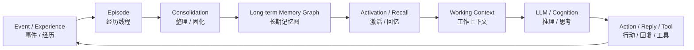
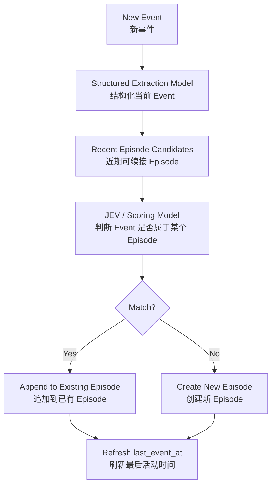
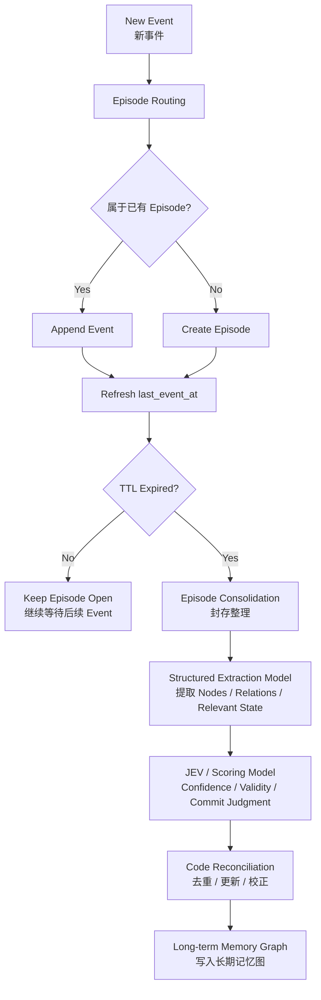
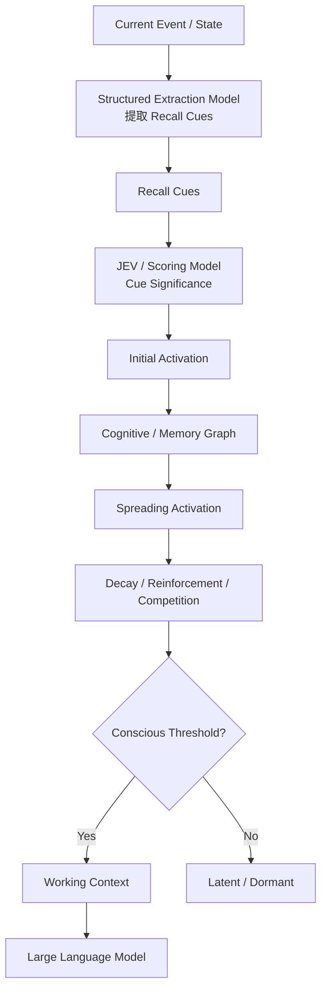
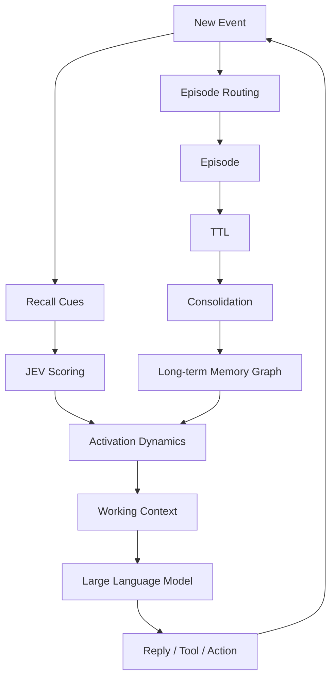

# Agent Memory 阶段性设计整理

> 状态：阶段性收束  
> 范围：当前已讨论完成的 Memory 写入路径、读取路径、Episode 极简方案与整体 Memory Loop  
> 原则：先形成最短闭环，再逐步增加复杂机制

---

# 0. 核心目标

当前 Agent Memory 设计已经形成一个完整闭环：

```text
Experience
→ Encode
→ Store
→ Activate
→ Recall
→ Cognition
→ Action
→ New Experience
```

也就是说：

> **经历产生记忆，记忆影响当前认知，当前认知再产生新的经历。**

整个系统可以拆成两条主路径：

```text
WRITE PATH
写入路径
```

和：

```text
READ PATH
读取路径
```

两者共同构成：

```text
Memory Loop
```

---

# 1. 整体 Memory Loop



可以概括为：

```text
经历
↓
形成 Episode
↓
写入长期记忆
↓
未来被重新激活
↓
进入 Working Context
↓
影响 LLM 的理解、推理与行动
↓
产生新的经历
```

---

# 2. 两类基础记忆

当前仍保留两类基础 Memory。

## 2.1 Semantic Memory

描述：

> **世界是什么样。**

典型形式接近：

```text
主语 + 关系 + 表语
```

例如：

```text
JEV --IS_A--> Scoring Model
```

```text
小天文 --IS_A--> Agent Memory 实验田
```

Semantic Memory 更偏向：

```text
事实
属性
关系
稳定状态
```

---

## 2.2 Episodic Memory

描述：

> **世界发生过什么。**

单个 Event 可以表示为：

```text
主语 + 谓语 + 宾语
```

但真正的长期时间记忆单位不是一条 Event，而是一段：

```text
Episode
```

例如：

```text
提出问题
→ 讨论
→ 修正
→ 得出结论
```

因此：

```text
Event ≠ Episodic Memory
Episode ≈ Episodic Memory Unit
```

---

# 3. Episode 的当前极简定义

前面曾讨论过：

```text
ACTIVE
SUSPENDED
CLOSED
ACHIEVED
FAILED
DEFERRED
...
```

但为了控制复杂度，当前 P0 不采用复杂状态机。

第一版 Episode 只保留最小结构：

```text
Episode
├── id
├── summary
├── events[]
└── last_event_at
```

必要时可以额外保留：

```text
relevant_state
```

但不在第一版中提前扩展大量参数。

---

# 4. Episode 不是简单时间切片

群聊场景中，一个话题可能被其他内容暂时打断。

例如：

```text
A1：讨论 Agent Memory
A2：继续讨论 Agent Memory

B1：今晚吃什么
B2：火锅吧

A3：继续讨论 Memory Strength
```

时间线上是：

```text
A1
A2
B1
B2
A3
```

但认知上更合理的是：

```text
Episode A:
A1 → A2 ─────→ A3

Episode B:
          B1 → B2
```

因此：

> **Episode 更接近语义线程，而不是连续时间片。**

---

# 5. Episode Routing

新 Event 到来时，需要判断：

> **它是否属于最近某个仍可续接的 Episode？**

第一版不遍历所有历史 Episode。

只考虑：

```text
recent / non-expired episodes
```

流程：



JEV 在这里负责：

```text
“这个 Event 和哪个 Episode 属于同一条语义线程？”
```

而不是做复杂状态机推理。

---

# 6. Episode TTL

为了避免 Episode 永久停留在当前工作集合中，引入一个以“天”为单位的：

```text
Episode TTL
```

定义：

> **如果一个 Episode 连续 N 天没有新的 Event 被归入，就认为它不再属于“可直接续接”的当前语义线程，可以进入封存与 Consolidation。**

例如：

```text
episode_ttl = 7 days
```

如果：

```text
now - last_event_at > episode_ttl
```

则：

```text
Episode
↓
Consolidation
↓
Long-term Episodic Memory
```

注意：

```text
TTL ≠ 删除
TTL ≠ 遗忘
```

TTL 只表示：

> **这条 Episode 不再保持“当前线程”身份。**

它被封存后仍然存在于长期记忆中。

未来如果再次相关，可以通过 Memory Recall 被重新想起。

---

# 7. 写入路径 WRITE PATH

当前写入路径已经基本明确：



写入端回答的问题是：

> **“这段经历最后留下了什么？”**

---

# 8. Episode Consolidation

当 Episode TTL 到期后，才统一做长期记忆整理。

不在每条消息到来时立刻写长期关系。

Consolidation 大致完成：

```text
Episode
↓
整理这段经历
↓
提取节点
↓
提取关系
↓
保存必要的 Relevant State
↓
判断关系是否可信 / 值得写入
↓
Reconcile
↓
Commit
```

---

# 9. Structured Extraction Model

当前不为以下任务分别部署多个模型：

```text
Cue Model
Relation Model
Episode Model
State Model
...
```

而是使用一个通用的：

```text
Structured Extraction Model
```

可能是一个参数量较小的 instruct model。

通过不同 task schema 执行：

```text
extract_cues
extract_relations
summarize_episode
extract_state_change
```

本质：

```text
Natural Language
↓
Constrained Structured Representation
```

它负责：

> **整理。**

不负责复杂评价。

---

# 10. JEV / Scoring Model

JEV 当前定位为：

```text
Scoring Model
```

形式：

\[
score = f(State, Question, Candidate)
\]

它负责模糊评价，例如：

```text
这个 Event 属于哪个 Episode？
这条关系可信吗？
这条关系值得写入吗？
这段 Memory 当前值得浮现吗？
这个 Recall Cue 是否值得更高激活？
```

核心原则：

> **模型负责模糊判断，Code 负责确定计算。**

---

# 11. Memory Object：丰富语义 + 极简机械状态

长期 Memory 不需要把所有意义都参数化。

当前采用：

```text
Memory / Relation Object
├── Semantic Payload
└── Mechanical State
```

---

## 11.1 Semantic Payload

允许丰富、灵活。

例如：

```text
description
rationale
context
notes
exceptions
hypothesis
decision
```

这些主要交给：

```text
LLM
Structured Extraction Model
Scoring Model
```

理解。

核心原则：

> **Rich Semantics**

---

## 11.2 Mechanical State

只保留真正参与动力学的极少状态。

当前主要考虑：

```text
confidence
association_strength
timestamps
counters
```

核心原则：

> **Minimal Mechanics**

---

# 12. Confidence、Association Strength、Activation

三个量必须分开。

## Confidence

表示：

> 这条关系有多可信？

属于：

```text
知识 / Epistemic Layer
```

---

## Association Strength

表示：

> 想到 A 时，现在有多容易联想到 B？

属于：

```text
长期联想层
```

而且它是：

> **动态的。**

共同激活越多：

```text
strength ↑
```

长期不用：

```text
strength ↓
```

---

## Activation

表示：

> 某个认知对象此刻有多活跃？

属于：

```text
Runtime / Current Cognition
```

所以：

```text
Confidence
≠
Association Strength
≠
Activation
```

---

# 13. Relation Edge

A 能激活 B，是因为：

```text
A --RELATION--> B
```

而不仅仅因为：

```text
similarity(A,B)
```

当前可能的关系类型包括：

```text
CAUSES
CONTRASTS_WITH
SIMILAR_TO
BEFORE
AFTER
PART_OF
ABOUT
IS_A
ENABLES
MODULATES
CONFLICTS_WITH
```

但第一版不需要一次实现全部关系类型。

只需要足够支撑实验的最小集合。

---

# 14. Relation Edge 的两层结构

关系不是裸边。

它可以表示为：

```text
Relation Edge
├── Semantic Payload
│   ├── relation_type
│   ├── description
│   ├── rationale
│   └── context
│
└── Mechanical State
    ├── confidence
    ├── association_strength
    └── temporal metadata
```

其中：

> **关系语义可以复杂，但参与 Code 运算的参数必须少。**

---

# 15. Association Strength 是动态的

当前认为：

```text
association_strength
```

不应在关系创建时写死。

它会随着 Agent 长期经历变化。

一个简单方向是：

\[
s_{AB}(t+1)
=
\lambda s_{AB}(t)
+
\eta A_A A_B
\]

其中：

```text
λ
= 长期衰减

η
= 共激活强化率

A_A, A_B
= 两节点当前 Activation
```

即：

> **经常一起被想到的东西，会越来越容易互相联想到。**

具体公式尚未定稿。

---

# 16. 读取路径 READ PATH

当前读取路径的核心不是传统 Top-K Retrieval。

而是：

> **当前状态产生 Recall Cues，Cue 向认知图注入激活，Activation 沿关系传播，最终部分 Memory 跨过阈值进入 Working Context。**

流程：



读取端回答的问题是：

> **“当前状态最终让什么重新浮现？”**

---

# 17. Recall Cue

不使用简单“关键词”概念。

使用：

```text
Recall Cue
```

定义：

> **能够触发旧认知结构的最小语义线索。**

可能包括：

```text
ENTITY
CONCEPT
RELATION
STATE
ACTION
GOAL
TEMPORAL
MODALITY
```

例如：

```text
“JEV 可以参与 Memory Activation”
```

可以整理为：

```text
ENTITY:
JEV

CONCEPT:
Memory Activation

RELATION:
JEV → MODULATES → Memory Activation
```

---

# 18. Emergence

当前对“涌现”的定义：

> **当前状态先向部分认知对象注入初始 Activation；Activation 随后沿带语义类型的关系传播，并受到衰减、强化、竞争等机制影响；最终，一些原本不在当前上下文中的对象跨过意识阈值，进入 Working Context。**

因此：

```text
Memory Retrieval
=
“去数据库里找什么？”
```

而：

```text
Memory Emergence
=
“当前认知状态最终让什么自己浮了上来？”
```

---

# 19. Embedding / Reranker 当前不是核心

当前 P0 不要求：

```text
Embedding
Reranker
```

它们未来可以作为：

```text
Optional Candidate Prefilter
```

用于大规模 Memory 时减少计算量。

因此：

```text
Embedding / Reranker
= Scale Optimization
```

而不是：

```text
Cognitive Core
```

---

# 20. 当前模型分工

整个系统当前收敛为：

```text
Structured Extraction Model
= 整理 / 结构化

JEV / Scoring Model
= 评分 / 判断

Memory Dynamics Engine
= 联想 / 传播 / 衰减 / 状态演化

Large Language Model
= 理解 / 推理 / 规划 / 生成
```

可以压缩成：

> **小模型整理，JEV 评分，Memory Dynamics 联想，LLM 思考。**

---

# 21. 图书馆类比

当前整个系统可以类比成图书馆。

## Structured Extraction Model

= 图书管理员

负责：

```text
整理
分类
提取实体
提取关系
建立目录
```

---

## JEV

= 馆藏评估员

负责：

```text
这个东西可信吗？
重要吗？
值得被激活吗？
值得写入吗？
属于哪个 Episode？
```

---

## Memory Graph + Dynamics

= 图书馆本身

负责：

```text
关系
联想
传播
强化
衰减
```

---

## Working Context

= 阅览桌

只保留：

```text
当前真正值得处理的少量内容
```

---

## LLM

= 研究者

负责：

```text
阅读
理解
推理
规划
表达
```

---

# 22. 写入与读取的最终闭环



---

# 23. 当前 P0 建议

为了避免系统复杂度失控，第一版只验证最小闭环。

## 写入

```text
Event
→ Episode Routing
→ Episode
→ TTL
→ Consolidation
→ Long-term Memory
```

## 读取

```text
Event / State
→ Recall Cues
→ JEV
→ Activation
→ Threshold
→ Working Context
```

第一版暂时不做：

```text
复杂 Episode 状态机
动态 TTL
大量 Relation Types
复杂 Inhibition
Embedding
Reranker
复杂 Strength 公式
自动多层 Semantic Consolidation
```

---

# 24. 当前尚未定稿的问题

后续再讨论：

1. Episode Routing 的最小输入与输出 Schema  
2. TTL 具体取多少天  
3. Consolidation 的最小输出 Schema  
4. 第一版 Relation Types 保留哪些  
5. Association Strength 如何更新  
6. Activation 如何传播与衰减  
7. Conscious Threshold 如何设定  
8. Semantic Memory 如何从多个 Episode 中长期沉淀

这些都不影响当前 Write / Read Loop 已经成立。

---

# 25. 当前阶段结论

当前已经完成的是：

```text
Memory Write
+
Memory Read
+
Memory Loop
```

写入端：

> **这段经历最后留下了什么？**

读取端：

> **当前状态让什么重新浮现？**

二者共同构成：

```text
Experience
→ Memory
→ Cognition
→ Action
→ Experience
```

因此当前阶段可以暂时收束。

---

# 26. 一句话总结

> **Agent 将连续经历组织成 Episode，Episode 在 TTL 到期后被 Consolidate 为长期记忆；未来事件产生 Recall Cues，JEV 对线索与候选进行评分，Memory Graph 通过关系传播 Activation，最终跨过阈值的内容进入 Working Context，由 LLM 继续推理并产生新的经历。**
