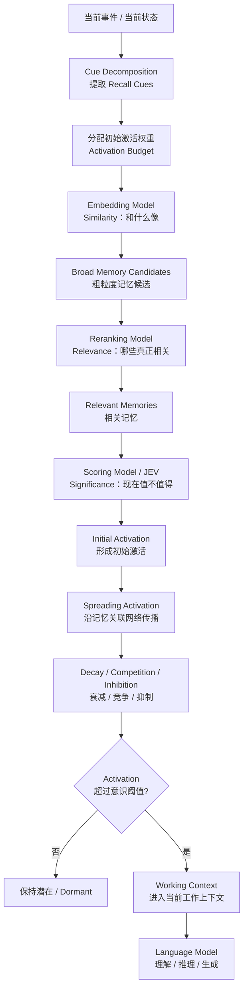
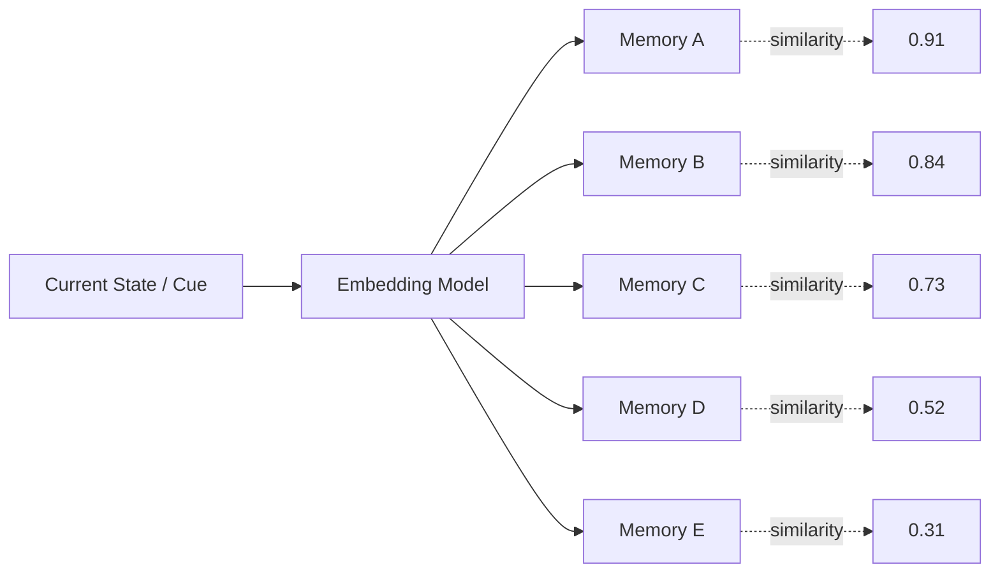
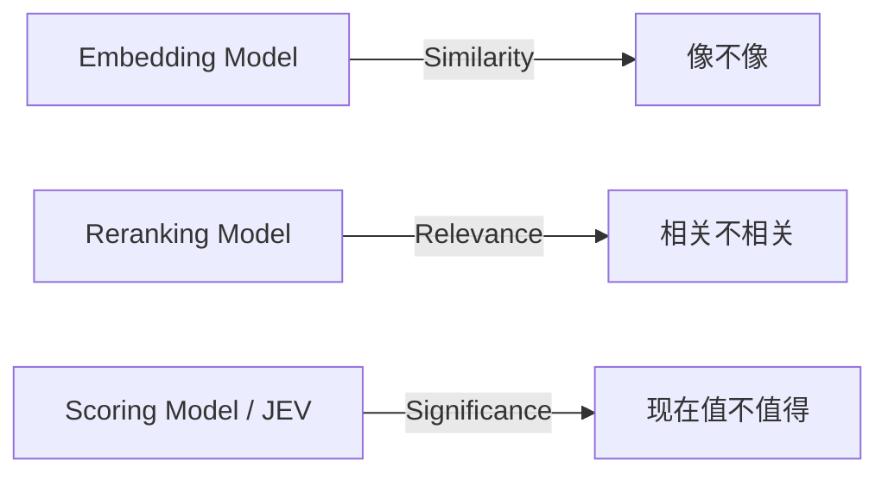
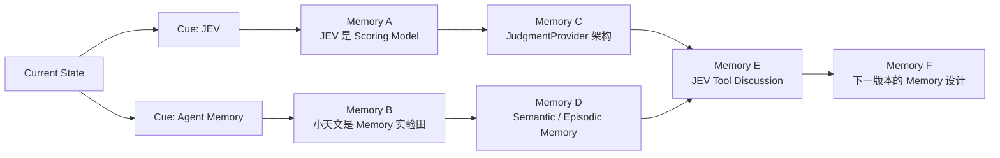
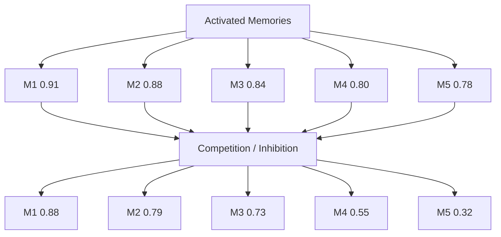
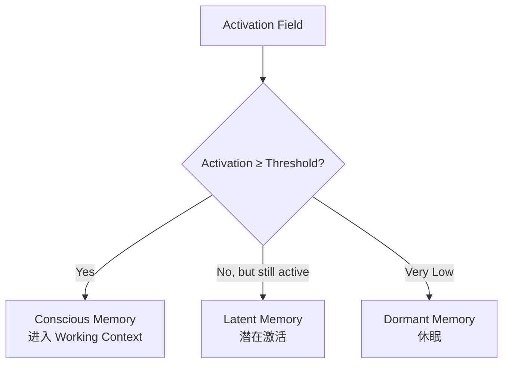
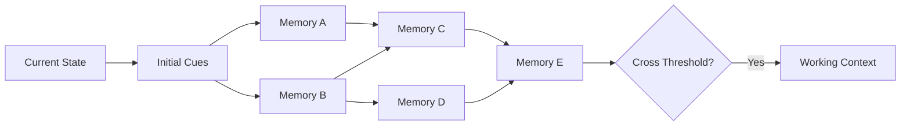

# 涌现式记忆机制说明

## 0. 核心思想

当前的核心假设是：

> **记忆不是被一次性“检索”出来的，而是在当前状态刺激下逐步被激活，并通过关联继续传播，最终部分记忆跨过阈值进入上下文。**

整个机制可以概括为：

```text
当前事件 / 当前状态
        ↓
分解出若干 Recall Cues
        ↓
为不同 Cue 分配激活权重
        ↓
寻找与 Cue 有联系的记忆候选
        ↓
计算相关性与当前意义
        ↓
形成初始 Activation
        ↓
记忆节点继续激活关联记忆
        ↓
Spreading Activation
        ↓
Decay / Competition / Inhibition
        ↓
部分记忆跨过 Conscious Threshold
        ↓
进入 Working Context
```

---

## 1. 总体工作流



---

## 2. Cue：当前事件提供最初的激活来源

每次发生事件时，从当前状态中提取若干认知线索。

例如：

```text
当前事件：
“下一版 Agent Memory 是否可以使用 JEV？”

Recall Cues：

JEV             0.30
Agent Memory    0.30
下一版本         0.15
长期记忆         0.15
小天文           0.10
```

这里的数值更适合理解为：

> **有限的初始激活预算（Activation Budget）**

而不是严格意义上的概率。

可以令：

\[
\sum_i w_i = 1
\]

其中：

- \(w_i\)：第 \(i\) 个 Recall Cue 的初始激活权重；
- 总和固定为 1，用来限制一次事件能注入到记忆系统中的总激活量。

这样做的意义是避免：

```text
每个 Cue 都很强
→ 每条 Memory 都被激活
→ 整个记忆网络很快全部点亮
```

---

## 3. Embedding：粗筛“像的”

Embedding Model 不负责决定某段记忆是否应该进入当前上下文。

它只回答：

> **这条当前信息和哪些已有对象在表示空间中比较接近？**



因此：

```text
Embedding
=
Similarity
=
“像不像？”
```

它适合承担大规模候选生成。

---

## 4. Reranker：缩小“真正相关”的范围

Embedding 找到的只是“可能有关”。

接下来使用 Reranking Model 判断：

> **这些候选中，哪些和当前问题真正相关？**

例如：

```text
Memory A：之前讨论过 JEV 是一个 Scoring Model
Memory B：之前讨论过小天文作为 Agent Memory 实验田
Memory C：之前用泡面测试过 JEV
Memory D：iPad PDF 手写体验
```

对于：

```text
“JEV 在 Memory Activation 中应该放在哪里？”
```

可能得到：

```text
Memory A    0.96
Memory B    0.82
Memory C    0.67
Memory D    0.05
```

因此：

```text
Reranker
=
Relevance
=
“相关不相关？”
```

---

## 5. JEV / Scoring Model：判断“当前值不值得”

JEV 不必负责普通语义相关性。

它更适合判断：

> **在当前完整认知状态下，这段记忆现在值得不值得被进一步激活？**

调用形式可以理解为：

```text
State
+
Question
+
Memory Candidate
        ↓
Scoring Model / JEV
        ↓
Significance Score
```

例如：

```text
Memory:
“之前使用泡面作为 JEV benchmark 示例。”

Reranker:
Relevance = 0.88

JEV:
Question:
“这段记忆现在值得进入工作意识吗？”

YES = 0.14
NO  = 0.86
```

这意味着：

> 这段记忆和主题确实有关，但当前并不值得占据 Working Context。

因此必须区分：

```text
Similarity
≠
Relevance
≠
Significance
```

对应：



---

## 6. Initial Activation：形成初始激活

假设当前状态产生多个 Cue：

\[
C_1, C_2, \dots, C_n
\]

每个 Cue 有一个初始权重：

\[
w_1,w_2,\dots,w_n
\]

并且：

\[
\sum_i w_i=1
\]

每个 Cue 对某段 Memory \(M_j\) 产生一个关联强度：

\[
r(C_i,M_j)
\]

那么可以先定义一个简单的初始激活：

\[
A_0(M_j)=\sum_i w_i \cdot r(C_i,M_j)
\]

如果再加入 JEV 的当前显著性判断：

\[
A_0(M_j)=
\sum_i w_i r(C_i,M_j)
+\beta \cdot JEV(S,M_j)
\]

其中：

- \(S\)：当前完整状态；
- \(JEV(S,M_j)\)：当前状态下该记忆的 significance score；
- \(\beta\)：JEV 对初始激活的影响系数。

注意：

> **Activation 不等于 Relevance。**

Activation 是多个因素综合作用后的动态状态。

---

## 7. 真正的“涌现”来自链式传播

如果系统只做到：

```text
Current State
↓
找到 Memory A
↓
Memory A 进入 Context
```

本质上仍然是 Retrieval。

真正的“涌现”来自：

> 已经被激活的记忆，会继续激活其他相关记忆。

例如：



这里的关键是：

```text
Memory F
```

可能与最初输入并没有很高的直接相似度。

但它可能通过：

```text
Current State
→ Memory A
→ Memory C
→ Memory E
→ Memory F
```

以及另一条：

```text
Current State
→ Memory B
→ Memory D
→ Memory E
→ Memory F
```

共同获得激活。

当多条路径的激活叠加后：

```text
Memory F activation
0.18
↓
0.32
↓
0.49
↓
0.73
```

最终超过 Conscious Threshold。

于是它被“想起来”。

---

## 8. Spreading Activation

可以把每个 Memory 看成图上的一个节点。

记忆之间存在 association：

```text
Memory A --0.8--> Memory B
Memory A --0.3--> Memory C
Memory B --0.6--> Memory D
```

如果 \(M_i\) 当前激活为：

\[
A_i(t)
\]

那么它可以把一部分 activation 传播到邻居：

\[
\Delta A_j
=
A_i(t)\cdot W_{ij}\cdot \gamma
\]

其中：

- \(W_{ij}\)：Memory \(i\) 到 Memory \(j\) 的关联强度；
- \(\gamma\)：传播系数。

例如：

```text
Memory A activation = 0.80
A → B association = 0.50
传播系数 = 0.60

B 获得：
0.80 × 0.50 × 0.60 = 0.24
```

因此记忆网络会形成动态的 Activation Field。

---

## 9. Decay：遗忘首先是“失去激活”

如果没有衰减，链式传播最终会点亮整个记忆库。

因此每一轮需要：

\[
A_i(t+1)=\lambda A_i(t)
\]

其中：

\[
0 < \lambda < 1
\]

例如：

```text
0.80
↓
0.64
↓
0.51
↓
0.41
↓
0.33
```

如果一段 Memory 后续没有获得新的激活来源，它就会逐渐沉下去。

因此：

> **遗忘首先不意味着 DELETE Memory，而意味着 Memory 的 Activation 逐渐消失。**

Memory 仍然存在，只是暂时想不起来。

---

## 10. Competition / Inhibition

Agent 的 Working Context 是有限的。

如果很多 Memory 同时被激活：

```text
M1 = 0.91
M2 = 0.88
M3 = 0.84
M4 = 0.80
M5 = 0.78
M6 = 0.74
```

不能把所有内容全部塞入上下文。

因此需要：

```text
Competition
+
Inhibition
```

例如：



强关联、持续被多个来源激活的 Memory 会留下来。

较弱或者互相冲突的 Memory 被压制。

---

## 11. Conscious Threshold

最终设置一个意识阈值：

\[
A_i \geq \theta_{conscious}
\]

Memory 才正式进入 Working Context。

例如：

```text
threshold = 0.70

Memory A = 0.91 → Conscious
Memory B = 0.82 → Conscious
Memory C = 0.72 → Conscious
Memory D = 0.54 → Latent
Memory E = 0.18 → Dormant
```

可以理解为：



所以：

> **Working Context 是当前整个 Activation Field 中最终浮到意识层的一小部分认知对象。**

---

## 12. 四种模型在机制中的分工

```mermaid
flowchart LR
    A[Embedding Model<br/>表示模型] -->|Similarity| B[发现可能相关的对象]
    B --> C[Reranking Model<br/>重排序模型]
    C -->|Relevance| D[缩小相关候选]
    D --> E[Scoring Model / JEV<br/>评分模型]
    E -->|Significance| F[判断当前值得程度]
    F --> G[Activation System]
    G -->|Emergence| H[Working Context]
    H --> I[Language Model<br/>语言模型]
    I -->|Reasoning / Generation| J[Response / Tool / Action]
```



四者可以简单记成：

| 模型 | 回答的问题 | 主要输出 |
|---|---|---|
| Embedding Model | 和什么像？ | Similarity |
| Reranking Model | 哪些真正相关？ | Relevance |
| Scoring Model / JEV | 当前状态下值不值得？ | Significance |
| Language Model | 对浮现内容如何理解和处理？ | Reasoning / Generation |

因此：

```text
Embedding
负责粗筛可能性

Reranker
负责缩小相关范围

Scorer / JEV
负责判断当前意义

Activation System
负责传播、竞争、衰减和涌现

LLM
负责处理真正进入 Working Context 的内容
```

---

## 13. Relevance、Significance、Activation 的区别

这是整个设计里最需要保持清晰的三层概念：

### Relevance

> 这段记忆和当前 Cue / Query 有多相关？

主要由：

```text
Reranker
```

计算。

---

### Significance

> 在完整的 Current State 下，这段记忆现在有多值得进一步处理？

主要由：

```text
Scoring Model / JEV
```

计算。

---

### Activation

> 在直接 Cue、相关性、JEV 判断、其他记忆传播、衰减和竞争共同作用之后，这段记忆当前有多活跃？

这是：

```text
Memory Dynamics
```

的结果。

可以暂时写成：

\[
Activation
=
Cue
+
Relevance
+
Significance
+
Association
-
Decay
-
Inhibition
\]

所以：

```text
Relevance
≠
Significance
≠
Activation
```

---

## 14. 一个完整的动态例子

当前事件：

```text
“JEV 在 Agent Memory 中应该怎么用？”
```

产生：

```text
Cue 1: JEV          0.45
Cue 2: Agent Memory 0.35
Cue 3: xtw-core     0.20
```

第一轮：

```text
M1: JEV 是 Scoring Model
Activation = 0.82

M2: 小天文是 Agent Memory 实验田
Activation = 0.66

M3: 泡面 benchmark
Activation = 0.42
```

M1 激活 M4：

```text
M4: JudgmentProvider 架构
+0.23
```

M2 激活 M5：

```text
M5: Semantic / Episodic Memory
+0.31
```

M4 与 M5 又共同激活：

```text
M6: JEV 调制 Memory Activation
```

M6：

```text
原始 Activation = 0.28

来自 M4 = +0.21
来自 M5 = +0.19
JEV Significance = +0.17
Decay = -0.08

最终：
0.77
```

若：

```text
Conscious Threshold = 0.70
```

则：

```text
M6 → Working Context
```

虽然 M6 最初并不是最直接的检索结果，但它最终通过网络传播浮现。

这就是：

> **Emergent Recall**

---

## 15. 最终定义

### Memory Retrieval

> 主动根据 Query 从 Memory Store 中寻找相关信息。

```text
Query
→ Search
→ Ranking
→ Top-K
```

### Memory Emergence

> 当前状态首先对一部分认知对象产生初始激活；激活随后沿记忆关联网络传播，并受到衰减、竞争和抑制影响；最终，一些原本不在当前上下文中的记忆，因为多个局部激活共同作用而跨过意识阈值，进入 Working Context。



因此最简化的区别是：

```text
Memory Retrieval
=
“去数据库里找什么？”

Memory Emergence
=
“当前认知状态最终让什么自己浮了上来？”
```

---

## 16. 当前阶段最值得先实验的四个变量

第一版实验不需要一次把所有机制都做全。

优先只研究：

```text
Cue
↓
Activation
↓
Propagation
↓
Decay
```

等这四项能够稳定工作之后，再逐渐加入：

```text
JEV Significance
Competition
Inhibition
Activation Budget
Semantic / Episodic Consolidation
```

这样更容易观察每一种机制究竟给最终 Recall 带来了什么变化。
