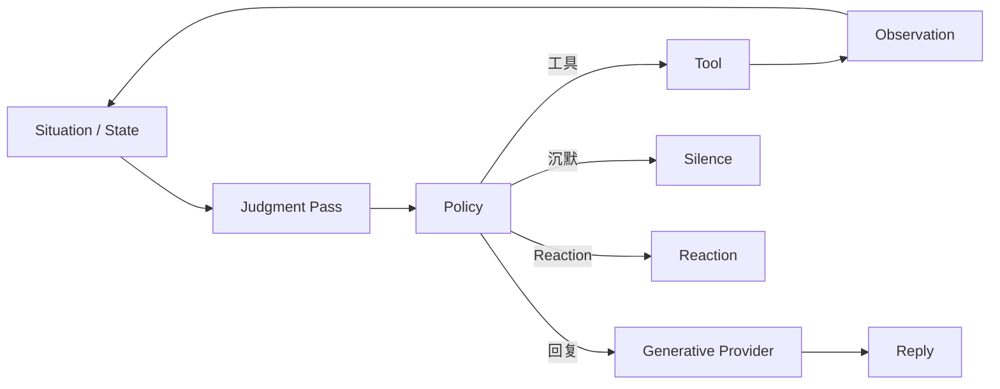

# xtw-core 0.1.0-jev

> 小天文下一代认知与行为运行时  
> Version: `0.1.0-jev`

---

## 1. xtw-core 是什么

`xtw-core` 是“小天文”的认知与行为运行时。

它不负责重新定义“小天文是谁”，也不试图把所有能力塞进一个大语言模型。

它负责把一次外部事件组织成完整的认知—行为闭环：

```text
发生了什么
    ↓
这件事对“我”意味着什么
    ↓
它改变了哪些内部状态
    ↓
现在是否应该采取行动
    ↓
应该采取什么行动
    ↓
行动产生了什么结果
    ↓
这次结果是否值得学习
    ↓
逐渐影响未来行为
```

整个系统的长期目标是：

> **让小天文真正拥有属于自己的经历，并让这些经历以受控、可解释、可回滚的方式逐渐改变未来行为，同时保持核心 Persona 与 SELF 稳定。**

---

## 2. 0.1.0-jev 的核心变化

`0.1.0-jev` 最大的变化，是正式引入：

```text
Judgment Provider
```

作为 Core 的基础能力之一。

当前主要实现可以使用 Jev / System-One Scorer。

但：

> **xtw-core 不依赖 Jev 本身。**

Core 只依赖统一的：

```text
JudgmentProvider
```

Jev 只是其中一种实现。

例如未来可以存在：

```text
JevJudgmentProvider

RuleJudgmentProvider

MockJudgmentProvider

RemoteJudgmentProvider

LLMStructuredJudgmentProvider
```

因此：

> **Jev 是 xtw-core 的判定基础设施，而不是 xtw-core 本身。**

---

## 3. 顶层原则

`0.1.0-jev` 将整个系统划分成三个阶段：

```text
来源
Source / Experience

    ↓

调用
Runtime / Action

    ↓

后学习
Post-learning
```

即：

```text
OBSERVE
  ↓
ACT
  ↓
LEARN
  ↓
下一次 OBSERVE
```

系统同时维持两条主要路径：

```text
Experience / Learning Path
Runtime / Action Path
```

以及独立的：

```text
Action
↓
Outcome
↓
Review
↓
Behavioral Prior
```

---

## 4. 总体架构

```mermaid
flowchart TD

    subgraph SOURCE["① 来源 / Experience"]
        IN["外部事件<br/>消息 / 图片 / @ / 回复<br/>定时事件 / 系统事件"]
        N["Normalize"]
        ID["Identity Resolution<br/>谁是谁"]
        P["Perspective Resolution<br/>和 SELF 是什么关系"]
        EXP["Canonical Experience<br/>规范化经历"]

        IN --> N --> ID --> P --> EXP

        EXP --> MEM["Memory"]
        EXP --> AFF["Affect"]
        EXP --> REL["Relationship"]
        EXP --> SIT["Situation"]
    end

    subgraph RUNTIME["② 调用 / Runtime"]
        PERSONA["Persona"]
        PRIOR["Behavioral Prior"]
        TOOLS["Tool Registry"]

        MEM --> CTX["Runtime Context"]
        AFF --> CTX
        REL --> CTX
        SIT --> CTX
        PERSONA --> CTX
        PRIOR --> CTX
        TOOLS --> CTX

        CTX --> J["Judgment Provider<br/>当前实现：Jev"]
        J --> POL["Policy Engine"]
        POL --> ACTION{"Action"}

        ACTION --> SIL["SILENCE / WAIT"]
        ACTION --> REACT["REACTION"]
        ACTION --> GEN["GENERATE / REPLY"]
        ACTION --> TOOL["TOOL"]

        GEN --> LLM["Generative Provider"]
        TOOL --> EXEC["Tool Runtime"]

        EXEC --> OBS["Observation"]
        OBS --> SIT
    end

    subgraph LEARN["③ 后学习 / Learning"]
        OUT["Environment Outcome"]
        EP["Episode"]
        REVIEW["Behavior Review"]
        EVIDENCE["Behavioral Evidence"]
        CONS["Consolidation"]

        OUT --> EP --> REVIEW --> EVIDENCE --> CONS
        CONS --> PRIOR
    end

    LLM --> OUT
    SIL --> OUT
    REACT --> OUT
```



---

## 5. 第一阶段：来源 / Experience

这一阶段只回答：

> **发生了什么？**

而不是：

> 我要不要回复？

处理链：

```text
Raw Event
↓
Normalize
↓
Identity Resolution
↓
Perspective Resolution
↓
Canonical Experience
```

### 5.1 Identity Resolution

Identity 负责：

> **谁是谁。**

昵称、别名、UID、群名片等，都不能直接等于实体。

例如：

```text
龙洲
龙舟
longz
某个 QQ UID
```

最终可能映射到：

```text
person:xxxxxxxx
```

核心原则：

> **Identity 稳定，Name 可以变化。**

### 5.2 Perspective Resolution

Perspective 回答：

> **这件经历和 SELF 是什么关系？**

例如：

```text
autobiographical
→ 我经历过

interpersonal
→ 我和某个人之间发生过

shared_group
→ 我们共同经历过

world_fact
→ 外部世界知识

hearsay
→ 我听说过
```

数据库内部允许使用第三人称实体 ID：

```yaml
actor: agent:xiaotianwen
```

但运行时必须知道：

```text
agent:xiaotianwen == SELF
```

从而将属于自己的经历投影成真正的第一人称经历。

### 5.3 Canonical Experience

完成身份和视角解析以后，产生：

```text
Canonical Experience
```

同一次 Experience 可以并行影响：

```text
Memory
Affect
Relationship
Situation
```

这些模块拥有各自的 authoritative state。

模块之间可以：

```text
read other state
```

但不应该：

```text
directly mutate other state
```

---

## 6. 第二阶段：调用 / Runtime

Runtime 回答的是：

> **基于现在的状态，小天文应该做什么？**

这一阶段的主要数据流为：

```text
State
↓
Judgment
↓
Policy
↓
Action
↓
Execution
↓
Observation
```

---

## 7. Runtime Context

进入一次行为判断之前，Core 会构造当前 Context。

典型内容包括：

```text
Persona

SELF

Current Event

Situation

Relevant Memory

Affect State

Relationship State

Behavioral Prior

Tool Registry
```

这里的 Context 不是完整历史聊天记录。

它是：

> **当前这一轮行动真正需要看到的认知快照。**

---

## 8. Judgment Provider

`JudgmentProvider` 是 `0.1.0-jev` 的核心新增抽象。

它专门负责：

> **所有答案空间有限的模糊判断。**

例如：

```text
现在是否应该回复？

是否应该调用工具？

是否应该检索记忆？

是否应该做 Reaction？

工具结果是否已经足够？

Episode 是否已经结束？

这是不是关系证据？

这次回复是否打断了别人？
```

其概念接口类似：

```python
class JudgmentProvider:
    async def judge(
        self,
        state: JudgmentState,
        questions: list[JudgmentQuestion],
    ) -> JudgmentResult:
        ...
```

---

## 9. Jev 在 Core 中的位置

当前 Jev scorer 的基本输入不是生成式聊天 Prompt。

而是：

```text
State
+
Question
+
Option
```

例如：

```text
State:
当前是群聊，用户正在讨论今晚上海是否能看到土星……

Question:
当前情境下，小天文是否应该回复？

Option:
应该回复
```

以及：

```text
State:
...

Question:
当前情境下，小天文是否应该回复？

Option:
不应该回复
```

模型分别计算每个 Option 的 scalar score，然后得到：

```text
P(option)
```

因此：

```text
Jev != Chat LLM
```

更准确地说：

```text
Jev = Judgment Scorer
```

---

## 10. Judgment 的基本形式

例如一次 Runtime Pass 可以声明：

```yaml
questions:

  - id: action.reply
    question: 当前情境下，小天文是否应该回复？
    options:
      - yes
      - no

  - id: action.reaction
    question: 当前情境下，小天文是否应该进行 Reaction？
    options:
      - yes
      - no

  - id: memory.retrieve
    question: 当前任务是否需要检索长期记忆？
    options:
      - yes
      - no

  - id: tool.weather
    question: 当前任务是否需要调用天气工具？
    options:
      - yes
      - no

  - id: tool.ephemeris
    question: 当前任务是否需要调用天文历表工具？
    options:
      - yes
      - no
```

一次 Batch Scoring 后可能得到：

```yaml
action.reply:
  yes: 0.94
  no: 0.06

action.reaction:
  yes: 0.04
  no: 0.96

memory.retrieve:
  yes: 0.09
  no: 0.91

tool.weather:
  yes: 0.81
  no: 0.19

tool.ephemeris:
  yes: 0.97
  no: 0.03
```

---

## 11. 工具不是互斥分类

工具调用尤其需要注意：

> **每个工具原则上应拥有独立 Judgment。**

不应该把：

```text
weather
web
ephemeris
memory
```

直接作为一个 softmax 里的互斥选项。

因为：

```text
P(ephemeris) = 0.97
P(weather) = 0.81
```

完全可以同时成立。

一次任务可能同时需要多个工具。

因此推荐：

```text
tool.weather
→ YES / NO

tool.web
→ YES / NO

tool.ephemeris
→ YES / NO

tool.memory
→ YES / NO
```

各自独立求值。

---

## 12. Judgment ≠ Action

这是 `0.1.0-jev` 最重要的约束之一。

Jev 输出：

```text
Judgment
```

而不是：

```text
Command
```

例如：

```yaml
action.reply:
  probability: 0.87
```

并不意味着立即回复。

后面还必须经过：

```text
Policy Engine
```

因此：

> **Judgment 提供认知判断。**  
> **Policy 拥有行为权限。**

---

## 13. Policy Engine

Policy 负责把概率判断转化成真正允许执行的动作。

它可以综合：

```text
threshold

cooldown

permission

budget

conflict

rate limit

Behavioral Prior

runtime constraints
```

例如：

```text
Jev:
P(reply) = 0.87

Policy:
reply threshold = 0.70
cooldown = active
```

最终仍然可以是：

```text
SILENCE
```

同样：

```text
P(tool.web) = 0.71
```

如果：

```text
threshold = 0.80
```

则：

```text
SKIP
```

当前版本可以推广出一个核心原则：

> **Judgment ≠ Action Permission.**

---

## 14. Action Space

Core 中 Silence 必须是一等 Action。

至少包括：

```text
SILENCE

WAIT

REACTION

REPLY

TOOL
```

因为：

> **理解某件事，并不意味着必须说一句话。**

---

## 15. Tool Runtime

当 Policy 批准某些工具后：

```text
ActionSet
↓
Tool Runtime
↓
Tool Result
```

Tool Result 不代表 Agent Loop 结束。

它只是新的：

```text
Observation
```

Observation 会更新当前 Situation / Working Context：

```text
Tool Result
↓
Situation Update
↓
New Runtime Context
↓
New Judgment Pass
```

于是形成运行时的小循环：

```text
Situation
↓
Judgment
↓
Policy
↓
Tool
↓
Observation
↓
Situation
↓
Judgment
↓
...
```

直到 Policy 最终选择：

```text
REPLY
SILENCE
REACTION
```

或者其他终止动作。

---

## 16. Generative Provider

生成模型与 Judgment Provider 严格区分。

生成模型负责：

```text
开放式语言生成

复杂自然语言表达

开放式推理

工具开放文本参数生成

复杂 Experience Interpretation

摘要与抽象
```

例如：

```text
是否调用 web_search？
```

属于：

```text
Judgment Provider
```

而：

```text
web_search 的 query 应该写什么？
```

如果无法由结构化 Context 直接确定，则属于：

```text
Generative Provider
```

因此：

```text
Code
→ 处理确定性问题

Judgment Provider
→ 处理有限答案空间的模糊问题

Generative Provider
→ 处理开放式推理与生成问题
```

---

## 17. Core 不允许生成模型直接获得行为权

`0.1.0-jev` 建议明确一个架构约束：

> **Generative Provider 不直接决定 Runtime Action。**

即生成模型不应该通过：

```json
{
  "should_reply": true,
  "tool_calls": [...]
}
```

直接控制整个 Agent Runtime。

需要调用什么、是否继续、是否回复，应由：

```text
Judgment
↓
Policy
```

决定。

Generative Provider 的职责是：

> **在 Core 已经决定需要生成时，完成具体的开放式内容。**

---

## 18. Runtime 小循环

一次实际 Runtime 可以抽象为：



核心不是：

```text
LLM → Tool → LLM → Tool
```

而是：

```text
State
↓
Judgment
↓
Policy
↓
Action
↓
Observation
↓
State
```

---

## 19. 第三阶段：后学习 / Post-learning

Runtime 解决：

> **这一次怎么做。**

Learning 解决：

> **这一次结果以后应该教会我什么。**

二者不能混在一起。

---

## 20. Episode 是行为复盘单位

Review 不评价某一句话。

它评价完整的：

```text
Situation

+

当时的 Memory / Affect / Relationship

+

Judgments

+

Policy Decision

+

Action

+

实际输出

+

对方回应

+

后续发展
```

这一整个互动片段称为：

```text
Episode
```

---

## 21. Review 中 Jev 的角色

Review 仍然可以使用 Judgment Provider。

例如：

```text
这次行动是否打断了别人？

工具选择是否合理？

回复是否过长？

对方是否真正参与了后续互动？

是否出现明显重复？

这个 Episode 是否提供了足够强的学习证据？
```

Jev 负责：

```text
Episode
↓
Judgment
↓
Behavioral Evidence
```

但不能直接产生永久行为规则。

---

## 22. Behavioral Evidence

Review 输出的是：

> **弱行为证据。**

例如：

```yaml
evidence:
  scope: group:astronomy

  tendency:
    unsolicited_reply:
      direction: negative

  confidence: 0.61

  source_episode: episode:123
```

单次 Episode 不应该直接变成：

```text
以后永远不要主动回复。
```

---

## 23. Consolidation

真正的长期学习发生在：

```text
Review Observations
↓
Aggregation
↓
Deduplication
↓
Confidence
↓
Decay
↓
Abstraction
↓
Behavioral Prior
```

因此：

> **Memory is retrieved. Policy is compiled.**

---

## 24. Behavioral Prior

Behavioral Prior 表示：

> **过去的经历让小天文以后更倾向怎么做。**

它不是 Persona。

它可以改变：

```text
什么时候更容易回复

什么时候保持沉默

某些工具的 activation threshold

主动接话概率

回复长度倾向

Reaction 倾向

某种场景下的行为阈值
```

例如：

```yaml
behavioral_prior:

  scope: group:astronomy

  action.reply:
    threshold_delta: +0.08

  action.reaction:
    threshold_delta: -0.05
```

表示：

```text
这个群里：
主动回复稍微谨慎一些，
但 Reaction 可以稍微积极一些。
```

它改变的是：

```text
Behavior
```

而不是：

```text
Core Persona
```

---

## 25. Persona 仍然保持稳定

Persona 继续回答：

> **“小天文是谁。”**

Core 不创建第二套 Persona。

Identity 负责机器内部 SELF 绑定：

```yaml
identity:
  self_entity: agent:xiaotianwen
```

因此：

```text
Persona
→ 核心人格

Identity
→ 谁是 SELF

Experience
→ SELF 经历了什么

Behavioral Prior
→ SELF 从经历中学会以后怎么做
```

Core Persona 原则上不自动修改。

---

## 26. 三种基础能力

`0.1.0-jev` 可以把运行时能力最终归纳成三类：

| 能力 | 负责什么 | 典型实现 |
|---|---|---|
| Deterministic Code | 已经可以确定的问题 | Python / 状态机 / 规则 |
| Judgment Provider | 有限答案空间中的模糊判定 | Jev |
| Generative Provider | 开放式生成、推理和表达 | GPT / Qwen / 其他 LLM |

判断方式：

```text
这个问题可以确定性解决吗？
│
├─ YES
│   ↓
│  Code
│
└─ NO
    │
    ├─ 答案空间是否提前知道？
    │
    ├─ YES → Judgment Provider
    │
    └─ NO  → Generative Provider
```

---

## 27. xtw-core 模块职责

建议的核心模块边界：

| 模块 | 职责 |
|---|---|
| `contracts` | 定义 Core 数据契约 |
| `context` | 构造 Runtime Context |
| `identity` | Entity / SELF / Perspective |
| `experience` | Canonical Experience |
| `judgment` | Judgment Questions / Results / Provider |
| `policy` | Threshold / 权限 / 冲突 / 预算 / Prior |
| `runtime` | 驱动 Agent Runtime Loop |
| `tools` | Tool Registry / Tool Execution |
| `episode` | Episode 生命周期 |
| `review` | Episode → Behavioral Evidence |
| `consolidation` | Evidence → Behavioral Prior |

外部模块则可以包括：

```text
Memory Backend / Iris

Affect Engine

Relationship Engine

Generative Provider

Jev Judgment Provider

AstrBot Adapter
```

---

## 28. Core 的职责边界

### Core 负责

```text
维护 SELF

统一 Experience

构建 Runtime Context

请求 Judgment

执行 Policy

形成 ActionSet

调度工具

调度生成模型

管理 Agent Loop

管理 Episode

管理 Behavioral Prior
```

### Core 不负责

```text
重新定义 Persona

成为 Memory 数据库

成为情绪插件

成为 Jev

绑定某一家模型 Provider

自己发送 AstrBot 消息

让生成模型直接控制整个 Runtime
```

---

## 29. Agent Loop

概念代码：

```python
async def handle(event):

    experience = experience_pipeline.process(event)

    await state.observe(experience)

    while True:

        context = context_builder.build(state)

        questions = judgment_registry.resolve(context)

        judgments = await judgment_provider.judge(
            state=context,
            questions=questions,
        )

        actions = policy.resolve(
            context=context,
            judgments=judgments,
        )

        if actions.empty:
            break

        results = await executor.execute(actions)

        await state.observe(results)

        if results.terminal:
            break
```

这段代码表达的不是具体实现，而是 Core 应保持的运行时语义：

```text
Observe

→ Build State

→ Judge

→ Resolve Policy

→ Act

→ Observe

→ Repeat
```

---

## 30. 两种 Loop

整个系统实际上包含两个不同时间尺度的循环。

### Fast Runtime Loop

```text
Situation
↓
Judgment
↓
Policy
↓
Action
↓
Observation
↓
Situation
```

目标时间尺度：

```text
毫秒 ～ 秒
```

Jev 主要服务这一层。

### Slow Learning Loop

```text
Experience
↓
Action
↓
Outcome
↓
Episode
↓
Review
↓
Behavioral Evidence
↓
Consolidation
↓
Behavioral Prior
```

时间尺度可以是：

```text
分钟
小时
天
甚至更长
```

---

## 31. 0.1.0-jev 的一句话架构

```text
Experience → State → Judgment → Policy → Action → Outcome → Learning
```

其中：

```text
Experience
= 我经历了什么

State
= 我现在处于什么状态

Judgment
= 现在有哪些事情值得做

Policy
= 哪些事情实际允许做

Action
= 我真正做了什么

Outcome
= 做完之后发生了什么

Learning
= 这次结果以后应该如何影响我的行为
```

---

## 32. Jev 的一句话定位

> **Jev 不负责成为小天文。**

> **Jev 不负责控制整个 Agent。**

> **Jev 负责回答 Core 中所有适合被表达为有限选项的问题。**

因此：

```text
Jev = Judgment Infrastructure
```

而不是：

```text
Jev = Agent
```

---

## 33. 最终心智模型

如果只记一个图：

```text
                    ┌──────────────┐
                    │   EXPERIENCE │
                    │    我经历什么 │
                    └──────┬───────┘
                           │
                           ▼
                    ┌──────────────┐
                    │    STATE     │
                    │    我现在怎样 │
                    └──────┬───────┘
                           │
                           ▼
                    ┌──────────────┐
                    │   JUDGMENT   │
                    │    值得做什么 │
                    │     Jev      │
                    └──────┬───────┘
                           │
                           ▼
                    ┌──────────────┐
                    │    POLICY    │
                    │     能做什么 │
                    └──────┬───────┘
                           │
                           ▼
                    ┌──────────────┐
                    │    ACTION    │
                    │     做什么    │
                    └──────┬───────┘
                           │
                           ▼
                    ┌──────────────┐
                    │   OUTCOME    │
                    │    结果怎样   │
                    └──────┬───────┘
                           │
                           ▼
                    ┌──────────────┐
                    │   LEARNING   │
                    │    学到什么   │
                    └──────┬───────┘
                           │
                           └──────────────→ 下一次 Experience
```

---

## 34. 0.1.0-jev 的核心不变量

1. **Persona 只有一套。**
2. **SELF 必须绑定到稳定 Canonical Entity。**
3. **每条 Experience 必须知道它和 SELF 的关系。**
4. **Memory、Affect、Relationship 各自维护自己的 authoritative state。**
5. **Judgment 只提供判定，不直接拥有行为权限。**
6. **Policy 决定是否真正执行 Action。**
7. **Silence 是一等 Action。**
8. **Tool Result 是 Observation，可以重新进入 Runtime Loop。**
9. **Generative Provider 不直接控制 Runtime。**
10. **Review 的单位是 Episode，而不是一句话。**
11. **单次 Episode 只产生 Behavioral Evidence，不直接形成永久行为规则。**
12. **Behavioral Prior 可以变化，Core Persona 原则上不自动变化。**
13. **Memory 用于检索经历，Policy 来源于长期证据的巩固。**
14. **Jev 是可替换的 Judgment Provider，而不是 Core 的硬依赖。**

---

## 35. Version Summary

```yaml
project: xtw-core

version: 0.1.0-jev

architecture:
  lifecycle:
    - source
    - runtime
    - post_learning

  runtime_loop:
    - state
    - judgment
    - policy
    - action
    - observation

providers:
  judgment:
    interface: JudgmentProvider
    current_candidate: Jev

  generative:
    interface: GenerativeProvider

core_concepts:
  - Entity
  - Identity
  - Perspective
  - Experience
  - Situation
  - Memory
  - Affect
  - Relationship
  - Judgment
  - Policy
  - Action
  - Episode
  - BehavioralEvidence
  - BehavioralPrior

primary_rule:

  "Experience → State → Judgment → Policy → Action → Outcome → Learning"
```

---

## 36. 最后一句

`xtw-core 0.1.0-jev` 的目标不是做一个：

> **“更会聊天的 LLM Wrapper”。**

而是建立一个真正具有：

```text
主体
经历
状态
判断
行动
结果
学习
```

完整生命周期的 Agent Runtime。

Jev 的加入解决的是其中一个非常关键的问题：

> **如何以足够低的成本和延迟，把 Agent 中大量隐式的“要不要做”判断，从生成模型中独立出来。**

而系统真正的主循环仍然是：

> **经历 → 行动 → 后果 → 学习 → 下一次经历。**
